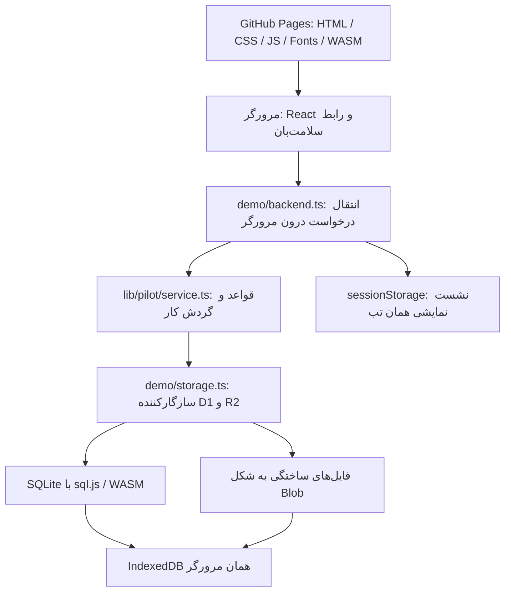
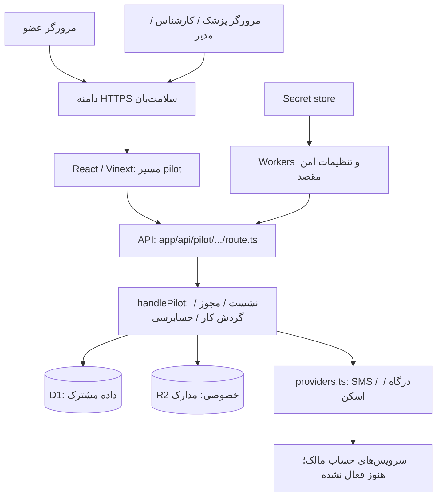

# ساختار فنی و اجرای سلامت‌بان

تاریخ: ۱۴ مهر ۱۴۰۵ / ۶ اکتبر ۲۰۲۶
مخزن: `ourgemeniprostudent-png/salamatban` — سورس در `main`، خروجی نمایش در `gh-pages`.

## معماری هدف برای ۱۰۰۰ کاربر فعال

این فایل، راهنمای کد موجود است. طراحی مستقل نسخهٔ عملیاتی در [معماری ۱۰۰۰ کاربر](architecture/SALAMATBAN-1000-USERS-fa.md)، [مدل دیتابیس و مهاجرت](architecture/database-1000-users-fa.md) و [DDL پیشنهادی PostgreSQL](architecture/postgresql-target-schema.sql) آمده است. آن طرح به پیاده‌سازی و آزمون بار نیاز دارد؛ محدودیت ۵۰ عضو و ذخیرهٔ مرورگری نسخهٔ فعلی در این تغییر افزایش نیافته‌اند.

## این نسخه دقیقاً چیست؟

سلامت‌بان اکنون یک **نسخه قابل ارائه با گردش کار اجرایی** دارد: عضو پرونده تشکیل می‌دهد، پزشک آن را بررسی و برنامه منتشر می‌کند و کارشناس نوبت را پیگیری می‌کند. هویت بصری مستقل، قلم پیدا، صفحه‌های عضو و پنل‌های کارکنان پیاده شده‌اند. این خروجی صرفاً تصویر یا ماکاپ نیست؛ ذخیره، کنترل نقش‌ها و تغییر وضعیت‌ها با منطق واقعی برنامه انجام می‌شود.

با این حال، **لینک عمومی فعلی نسخه نهایی پذیرش کاربران واقعی نیست**. در GitHub Pages، داده و فایل در مرورگر همان بازدیدکننده‌اند؛ کاربر و پزشک روی دو دستگاه مستقل، یک پرونده مشترک نمی‌بینند. پیامک، پرداخت و اسکن واقعی فعال نیستند. کد مسیر سروری وجود دارد و باید با زیرساخت، حساب سرویس، فرآیندهای عملیاتی و آزمون مقصد به خدمت واقعی تبدیل شود. آماده‌بودن طراحی و آماده‌بودن بهره‌برداری دو وضعیت مستقل‌اند.

لینک نمایش: https://ourgemeniprostudent-png.github.io/salamatban/
مرجع جاری: [وضعیت تحویل](DELIVERY-STATUS-fa.md)، [آزمون برنامه](../review-evidence/ux-release.json) و [انتشار عمومی](../review-evidence/ux-publication.json).

## از کجا شروع کنید؟

| نیاز | مرجع |
|---|---|
| اجرای سریع و معرفی پوشه‌ها | [README اصلی](../README.md) |
| دامنه قابلیت‌ها، موارد موجود و برنامه توسعه | [معماری محصول](salamatban-product-architecture-fa.md) |
| وضعیت کنترل‌های انتشار | [چک‌لیست تحویل](salamatban-release-checklist-fa.md) |
| معرفی و روش بررسی | [راهنمای کوتاه](SHOWCASE-GUIDE-fa.md) |
| هویت، نشان، رنگ‌ها و قلم | [راهنمای برند](../site/public/brand/README-fa.md)، [راهنمای تعاملی](../site/public/brand/index.html)، [PDF](Salamatban-Visual-Identity.pdf) |
| انتشار فایل‌های نمایش | [راهنمای استقرار](../deployments/README-fa.md) |
| آزمون برنامه | [گزارش جاری](../review-evidence/ux-release.json) |

`reference-code/` و `reference-docs/` آرشیو ورودی‌اند؛ صفحات آن‌ها داخل build فعال نیستند. نام فایل یا واژه «complete» در بسته دریافتی، معیار انتخاب نسخه اجرایی نیست. مبنا، مسیرهای فعال زیر و گزارش آزمون همان کامیت است.

## معماری فعلی نمایش روی Pages



در این حالت درخواست‌های `/api/pilot/*` به سرور API ارسال نمی‌شوند؛ `transport` به سازگارکننده مرورگری وصل است و همان `handlePilot` را داخل مرورگر فراخوانی می‌کند. داده با قفل مرورگر بین تب‌ها هماهنگ می‌شود. فضای داده به origin و زیرمسیر وابسته است؛ تغییر دامنه یا پوشه، فضای نمایش دیگری می‌سازد. پاک‌کردن داده مرورگر یا «شروع دوباره نمایش» اطلاعات آن نمایش را پاک می‌کند. این مدل برای داده ساختگی و مرور محصول مناسب است؛ وجود کنترل نقش در شبیه‌ساز، محافظت سروری برای داده واقعی ایجاد نمی‌کند.

## مسیر موجود برای نسخه سروری و بهره‌برداری واقعی



اتصال API به `env.DB` و `env.FILES` نوشته شده است. پیکربندی محلی برای شبیه‌سازی D1/R2 آماده است؛ شناسه جایگزین محلی در `vite.config.ts` یا `wrangler.local.jsonc` تنظیم production محسوب نمی‌شود. محیط مقصد، bindingهای واقعی، دامنه، secretها و تنظیم استقرار باید جداگانه ساخته شوند. GitHub Pages و فایل ZIP به‌تنهایی این بخش را اجرا نمی‌کنند.

معماری پیشنهادی برای ادامه یک برنامه یکپارچه با ماژول‌های روشن است. جداکردن هویت، پرونده، بررسی، برنامه، مدارک، پرداخت و هماهنگی از فایل سرویس می‌تواند تدریجی باشد. مهاجرت به PostgreSQL یا میزبان متفاوت هنوز انجام نشده و نیازمند سازگارکننده ذخیره‌سازی، مهاجرت داده و تکرار آزمون‌هاست؛ برای راه‌اندازی روی بستر کنونی الزامی نیست.

## نقشه فایل‌های فعال

همه مسیرهای جدول از ریشه مخزن‌اند.

| مسیر | مسئولیت |
|---|---|
| `site/app/page.tsx` | انتقال مسیر ریشه برنامه سروری به `/pilot` |
| `site/app/pilot/pilot.tsx` | ورود، وضعیت نشست، فرم مرحله‌ای، ناوبری نقش‌ها و عملیات اصلی |
| `site/app/pilot/member-views.tsx` و `.css` | خانه سلامت، تصویر سلامت، مدارک، حساب و خط زمان برنامه |
| `site/app/pilot/brand.tsx`، `pilot.css`، `site/app/brand.css` | نشان/آیکون و سبک مشترک رابط |
| `site/app/pilot/persian-date-picker.tsx` و `.css` | انتخابگر شمسی تاریخ تولد و موعد؛ آزموده در مرورگر و موبایل شبیه‌سازی‌شده |
| `site/lib/persian-date.ts` | تبدیل و اعتبارسنجی تاریخ شمسی/ISO |
| `site/app/api/pilot/[...path]/route.ts` | ورودی GET/POST/PUT، اتصال به DB/FILES و تنظیمات |
| `site/lib/pilot/service.ts` | گردش کار، SQL، مجوز نقش/مالکیت، سفارش، انتشار و حسابرسی |
| `site/lib/pilot/domain.ts` و `intake.ts` | مدل دامنه، اعتبارسنجی، قواعد فرم و وضعیت‌ها |
| `site/lib/assessment-definition.ts` | تعریف نسخه فعلی پرسش‌ها؛ تغییر آن نیازمند مرور بالینی است |
| `site/lib/pilot/crypto.ts` | هش، توکن، OTP و TOTP |
| `site/lib/pilot/providers.ts` | واسط ارسال OTP، درخواست/تأیید پرداخت و قرارداد اسکن |
| `site/lib/pilot/config.ts` و `site/.dev.vars.example` | متغیرها و کنترل آمادگی حالت live؛ فایل نمونه فاقد کلید واقعی است |
| `site/db/pilot-schema.ts` | طرح فعال Drizzle |
| `site/drizzle-pilot/0000_optimal_wind_dancer.sql` | مهاجرت پایه فعال |
| `site/drizzle-pilot/0001_guards.sql` | قیدهای تکمیلی یکپارچگی و هم‌زمانی |
| `site/drizzle-pilot/0002_violet_morgan_stark.sql` | آدرس و مختصات درخواست خدمت نمایشی |
| `site/drizzle-pilot/0003_great_bedlam.sql` | اتصال اقدام برنامه به کار هماهنگی؛ مجموع ۱۴ جدول فعال |
| `site/drizzle.config.ts` و `drizzle.pilot.config.ts` | تولید مهاجرت طرح فعال SQLite |
| `site/demo/main.tsx`، `backend.ts`، `storage.ts` | ورودی نمایش مرورگری و ذخیره محلی |
| `site/demo/bundle.mjs` و `response.ts` | سازگاری build مرورگری با منطق سرویس |
| `site/demo/build.mjs` و `package.mjs` | ساخت `dist-demo/` و ZIP/manifest قابل انتشار |
| `scripts/publish_demo_pages.py` | بررسی هش ZIP و پوش فایل‌ها روی `gh-pages` |
| `site/public/brand/` و `site/public/fonts/` | هویت مستقل سلامت‌بان و ۹ وزن Peyda |

فقط `site/drizzle-pilot/` روی پایگاه فعال اعمال شود. طرح قدیمی `reference-code/drizzle/` با مدل پایلوت یکی نیست. برای تغییر طرح، مهاجرت تازه بسازید؛ فایل SQL اعمال‌شده را بازنویسی نکنید. در نمایش مرورگری مهاجرت‌های فعلی هنگام اولین ساخت پایگاه اجرا می‌شوند؛ افزودن مهاجرت برای IndexedDB موجود به مسیر ارتقای صریح نیاز دارد و تنها افزودن فایل SQL کافی نیست.

## نقش‌ها، داده و قراردادهای مهم

| نقش | کار مجاز | مرز دسترسی |
|---|---|---|
| `member` — عضو | پرونده خود، مدارک، سفارش، برنامه منتشرشده، پیشرفت، نوبت و پشتیبانی | پرونده عضو دیگر قابل مشاهده نیست |
| `clinician` — پزشک | صف تخصیص‌یافته، مدارک/پاسخ‌ها، درخواست تکمیل، رسیدگی هشدار، انتشار و بازگشایی برنامه | فقط اعضای تخصیص‌یافته؛ فعال‌بودن نقش به معنی دسترسی به همه نیست |
| `coordinator` — کارشناس | تماس و اطلاعات لازم نوبت، تغییر وضعیت هماهنگی، ثبت تأیید مرکز | پاسخ‌های بالینی و فایل پزشکی در اختیارش نیست |
| `admin` — مدیر | دعوت/تعلیق/تخصیص پزشک، ظرفیت، شمارنده‌ها، مغایرت پرداخت و پاسخ پشتیبانی | دسترسی خودکار به پرونده پزشکی ندارد |

| گروه داده | جدول‌ها و نکته |
|---|---|
| هویت | `pilot_users`، `pilot_otp`، `pilot_sessions`، `pilot_rate_limits`؛ نشست در سرور با digest ذخیره می‌شود |
| پرونده | `pilot_records`؛ profile/answers به شکل JSON، نسخه، مرحله، رضایت، وضعیت و هشدار |
| مدارک | `pilot_files`؛ metadata/checksum/object key در DB، بایت‌ها در R2 یا ذخیره نمایشی |
| سفارش | `pilot_orders`؛ مبلغ ریالی و نسخه قیمت از سرور، authority و reference مستقل، تکرار امن |
| برنامه | `pilot_plans`؛ نسخه منتشرشده، پزشک، snapshot پرونده و اقدام‌ها |
| پیشرفت | `pilot_action_updates`؛ تاریخچه گزارش عضو، بدون ویرایش برنامه مصوب |
| عملیات | `pilot_tasks` برای هشدار/نوبت، `pilot_feedback` برای درخواست و پاسخ، `pilot_booking_locations` برای آدرس، `pilot_task_actions` برای اتصال اقدام و کار |
| حسابرسی | `pilot_audit`؛ رویدادهای اصلی بدون ذخیره متن کامل پرونده در لاگ |

API فعلی در ریشه `/api/pilot/` است: `meta` و `me`، `auth/request|verify|logout`، `record` و `record/submit`، `files` و `files/:id`، `payment` و `payment/callback|demo|reconcile`، `actions`، `booking`، `feedback` و مسیرهای `staff/queue|review|booking|feedback|invite|member`. فهرست شرط‌ها و بدنه دقیق ورودی در `service.ts` و سناریوهای آزمون آن قرار دارد؛ قرارداد OpenAPI مستقل تولید نشده است.

API داده بالینی را در سرور با نقش، مالکیت/پزشک تخصیص‌یافته و وضعیت گردش کار کنترل می‌کند. عملیات تغییر به origin صحیح و CSRF نیاز دارند. ویرایش پرونده با شماره نسخه انجام می‌شود؛ خطای `VERSION_CONFLICT` نباید با بازنویسی خاموش دور زده شود. مبلغ از فرم کاربر پذیرفته نمی‌شود و موفقیت callback تنها پس از verify معتبر به پرداخت قطعی تبدیل می‌شود.

**قرارداد تاریخ جاری (از تحویل تقویم):** انتخاب روز در رابط شمسی است؛ مقدار روز تقویمی در API و داده همچنان ISO میلادی `YYYY-MM-DD` می‌ماند. متن فارسی نمایش نباید به جای مقدار ISO ذخیره یا برای مرتب‌سازی مقایسه شود. زمان رخدادها همچنان timestamp است و قواعد هر فیلد جداگانه اعمال می‌شود. تبدیل رفت‌وبرگشت همه روزهای ۱۹۰۰ تا ۲۱۰۰، اسفند کبیسه، ارقام فارسی/عربی، ورودی نامعتبر، محدودیت سن/موعد، ذخیره پس از Refresh و انتخاب سریع با صفحه‌کلید در مرز نوروز آزموده شدند. تبدیل روز بدون وابستگی به timezone مرورگر است؛ حد امروز و موعد مانند اعتبارسنجی فعلی سرور بر مبنای UTC است. زمان نوبت کارشناس فعلاً متن آزاد است و قرارداد timestamp مستقلی ندارد.

## جریان عملی کاربر و تیم

۱. **مدیر:** پزشک و کارکنان توسط اپراتور مجاز در محیط مقصد ایجاد می‌شوند. مدیر عضو را دعوت و پزشک مسئول را مشخص می‌کند؛ سقف فعلی ۵۰ عضو فعال است. دعوت در پنل، صدور دسترسی است و پیام دعوت خودکار نمی‌فرستد.

۲. **عضو:** با شماره دعوت‌شده و کد وارد می‌شود. در دمو کد روی صفحه است؛ در خدمت واقعی SMS باید فعال باشد. رضایت بررسی را می‌پذیرد و رضایت هماهنگی را جدا انتخاب می‌کند. مشخصات، علائم مهم، سوابق و مدارک را مرحله‌ای ذخیره می‌کند. تاریخ تولد از تقویم شمسی انتخاب می‌شود و ISO ثبت می‌شود.

۳. **مرور و پرداخت:** عضو خلاصه را می‌بیند، هزینه ارزیابی را می‌پردازد و پرونده را ارسال می‌کند. نداشتن مدرک، به‌تنهایی مانع ارسال نیست. ارسال عادی به رضایت جاری، پاسخ معتبر، نبود هشدار حل‌نشده و پرداخت تأییدشده نیاز دارد. پس از ارسال، ویرایش عادی قفل است.

۴. **پزشک:** فقط پرونده تخصیص‌یافته را بررسی می‌کند. می‌تواند با توضیح مشخص اطلاعات بیشتری بخواهد؛ پرونده برای تکمیل به عضو برمی‌گردد و پرداخت دوباره لازم نیست. پس از بررسی، جمع‌بندی و ۱ تا ۱۲ اقدام با دلیل، مسئول و موعد در ۱۲ ماه آینده منتشر می‌کند. هر نسخه منتشرشده حفظ می‌شود؛ اصلاح با بازگشایی و نسخه جدید انجام می‌شود.

۵. **عضو:** در تصویر سلامت جمع‌بندی پزشک و در برنامه، اقدام‌ها و موعدها را می‌بیند. انجام اقدام و شاهد آن را گزارش می‌کند. این گزارش، تأیید پزشکی انجام خدمت نیست. در صورت نیاز درخواست هماهنگی نوبت می‌دهد.

۶. **کارشناس:** درخواست را به «در حال هماهنگی» می‌برد؛ برای تأیید باید مرکز، زمان، کد تأیید و رضایت انتقال اطلاعات همان مرکز ثبت شوند. عضو نتیجه را در نوبت‌های خود می‌بیند. وضعیت‌های بعدی انجام یا لغو هستند.

۷. **پشتیبانی و مدیر:** مشکل، پیشنهاد، دریافت داده، حذف و بازپرداخت ثبت و پاسخ داده می‌شود. پاسخ یا بستن درخواست به‌تنهایی شاهد حذف داده یا انتقال پول نیست؛ فرآیند اجرایی این موارد هنوز باید تکمیل شود.

**مسیرهای استثنا:** علامت خطر پیام فوری روی صفحه و پس از ذخیره پیگیری پزشک ایجاد می‌کند؛ پرداخت عادی تا رسیدگی پزشک متوقف است. سرویس جای اورژانس نیست. پرداخت نامشخص در وضعیت بررسی می‌ماند؛ کاربر نباید برای رفع ابهام دوباره پول بدهد. تعلیق عضو، نشست‌های فعالش را باطل می‌کند.

برای نمایش همه مراحل، نقش‌ها را در همان مرورگر عوض کنید؛ خروج از حساب، پرونده نمایشی را پاک نمی‌کند. در بهره‌برداری سروری، هر نقش با حساب خودش به داده مشترک دارای مجوز دسترسی خواهد داشت.

## اجرای محلی و آزمون

پیش‌نیازها: Node.js 24 توصیه‌شده، npm، Python 3 برای ZIP/انتشار، Chromium برای آزمون رابط. حد نسخه Node در `site/package.json` ثبت شده است.

از ریشه مخزن:

```sh
cd site
npm ci --registry=https://registry.npmjs.org
npm run db:local
PILOT_MODE=demo PILOT_ORIGIN=http://localhost:4173 npm run dev -- --port 4173
```

ورودی توسعه `http://localhost:4173/pilot` است. داده محلی Workers در `site/.wrangler/` می‌ماند. پایگاه آزمون سرویس جداگانه ساخته می‌شود. برای سرویس واقعی هیچ پایگاه/مخزن دمو را دوباره استفاده نکنید.

پس از پایان سرور توسعه، فرمان‌های بررسی از پوشه `site`:

```sh
npm test
npm run test:calendar
npm run lint
npx tsc --noEmit
npm run build
npm run build:demo
npm run test:demo
npm run test:ux
npm run test:workflow
npm run test:edges
npm run test:startup
npm run package:demo
```

`test:calendar` و `site/tests/persian-date.test.mjs` آزمون‌های تبدیل و اعتبارسنجی تقویم‌اند. آزمون مرورگر از `/usr/bin/chromium` استفاده می‌کند؛ در صورت نیاز `CHROMIUM_PATH` را به Chromium نصب‌شده تنظیم کنید. `npm test` گزارش `review-evidence/api-tests.json` را بازنویسی می‌کند؛ هنگام تحویل، نتیجه جدید را با تاریخ/کامیت ثبت کنید و شواهد قبلی را با ادعای مربوط به نسخه جدید جایگزین نکنید.

در خط پایهٔ ۱٫۷، ۴۰ بررسی API و مجموع ۷۸ بررسی مستقل در مجموعه‌های تقویم، رابط، نقش‌ها، مسیرهای خطا و بارگذاری موفق‌اند (۸۳ با احتساب پنج آزمون والد). خط پایهٔ عمومی ۲٫۳ در `review-evidence/ux-baseline-v2.3.json` حفظ شده است؛ نتیجهٔ تغییر اتصال نشان در بستهٔ ۲٫۳٫۱ جدا ثبت می‌شود و فعال‌شدن سرویس را ثابت نمی‌کند. نتیجهٔ کامل و محدودیت‌ها در [گزارش جریان‌ها](FLOW-REVIEW-v1.7-fa.md) و `review-evidence/ux-release.json` است.

## ساخت و انتشار نسخه نمایشی

خروجی build مرورگری در `site/dist-demo/` و بسته در `deployments/salamatban-demo.zip` ساخته می‌شود. `deployments/salamatban-demo.json` هش و مشخصات بسته را دارد. build، سرویس واقعی را فعال نمی‌کند.

پس از آزمون و ثبت سورس/بسته روی `main`، از ریشه مخزن اجرا کنید:

```sh
python3 scripts/publish_demo_pages.py
```

این فرمان **تغییر بیرونی انجام می‌دهد**: هش ZIP را بررسی می‌کند و فایل‌های نمایش را بدون force-push روی `origin/gh-pages` می‌فرستد؛ checkout فعلی را جابه‌جا نمی‌کند. تنظیم Pages باید `Deploy from a branch`، شاخه `gh-pages` و پوشه `/ (root)` باشد. سپس موفقیت انتشار را در GitHub و URL عمومی بررسی کنید. منبع، ZIP و خروجی Pages باید مربوط به یک نسخه باشند. برای برگشت، بسته نسخه شناخته‌شده را دوباره بسازید/اعتبارسنجی و از همین مسیر منتشر کنید؛ بازگرداندن فایل‌ها، داده IndexedDB کاربران را تغییر نمی‌دهد.

برای هاست اشتراکی، محتوای ZIP مستقیماً داخل پوشه HTTPS مشخص Extract می‌شود؛ `index.html` باید در ریشه همان پوشه قرار گیرد. راهنمای مقصد و مراحل در [deployments/README-fa.md](../deployments/README-fa.md) است. سورس، `.dev.vars`، secretها و پایگاه محلی نباید در فایل‌های عمومی قرار گیرند.

## کارهای مشخص مانده تا استفاده واقعی

| کار | خروجی قابل قبول | وابستگی |
|---|---|---|
| انتخاب محیط واقعی | دامنه HTTPS، runtime فعال، DB مشترک، فایل خصوصی، staging جدا | مالک زیرساخت و محل داده |
| ورود واقعی | OTP شبکه واقعی، MFA کارکنان، دعوت و تعلیق آزموده | حساب SMS و حساب‌های کارکنان |
| پرداخت | قیمت و سیاست مصوب، تراکنش کنترل‌شده، verify/تکرار/قطعی/مغایرت آزموده | مالک درگاه و مالی |
| امنیت فایل | اسکن واقعی و رد حالت مشکوک/قطعی، کنترل دانلود در مقصد | اسکنر منتخب و قرارداد داده |
| رویه بالینی | تأیید همین نسخه فرم و هشدار، پزشک/جانشین، زمان رسیدگی | مسئول بالینی |
| رضایت و حریم خصوصی | متن نهایی، نگهداری، احراز هویت درخواست خروجی/حذف و شاهد اجرا | مالک داده و مسئول حقوقی |
| بازپرداخت | مسئول، مبلغ، مرجع و ثبت نتیجه واقعی | مالی و سیاست لغو/بازپرداخت |
| عملیات | پایش قطعی/خطای پرداخت/صف هشدار، پشتیبانی و مسئول پاسخ | عملیات فنی و تیم مراقبت |
| بازیابی | بازیابی DB و فایل ساختگی در محیط مستقل، زمان/میزان از‌دست‌رفتن مجاز داده | میزبان و سیاست پشتیبان |
| آزمون نهایی | دستگاه واقعی، شبکه ضعیف، دسترس‌پذیری، بررسی امنیت و وابستگی مقصد | QA و فنی |

بسته همراهی/اشتراک، یادآوری پیامکی زمان‌دار، تقویم ظرفیت مراکز و اتصال CRM در مدل فعال کامل نیستند. برای پایلوت ارزیابی با هماهنگی انسانی، اضافه‌کردن همه آن‌ها شرط فنی شروع نیست؛ اگر وارد تعهد محصول شوند، به مدل داده، صف/زمان‌بند، قرارداد و آزمون مستقل نیاز دارند. نام خدمات یا موفقیت نمایشی نباید جای این اتصال‌ها را بگیرد.

حالت `live` فقط با همه تنظیمات لازم در `config.ts` فعال می‌شود. `PILOT_LAUNCH_READY` و `CLINICAL_CONTENT_APPROVED` قفل پیکربندی‌اند؛ مقدار `true` جای مدارک بالا را نمی‌گیرد. حساب‌ها و کلیدها در secret store مقصد تنظیم شوند، نه Git یا پیام گفتگو.

## معیار پذیرش برنامه‌نویس و تصمیم انتشار

- تحویل فنی: روی checkout تمیز نصب، migrations فعال، build و همه آزمون‌های مربوط به تغییر موفق باشند؛ داده بین Refresh و تغییر نقش در سناریوی صحیح باقی بماند.
- تقویم: ورودی شمسی واقعی در همه فیلدهای روز، ذخیره ISO معتبر، حفظ داده‌های قبلی، رفت‌وبرگشت بدون تغییر روز، کبیسه/اسفند، حد سن و موعد، صفحه‌کلید و موبایل بررسی شوند.
- گردش کار: دو عضو مستقل، پزشک تخصیص‌یافته، هماهنگی، پرداخت دمو و پشتیبانی انتهابه‌انتها کار کنند؛ دسترسی غیرمجاز و نسخه هم‌زمان رد شوند.
- انتشار نمایشی: build و فایل عمومی یکسان، Pages موفق، دارایی‌ها و فونت‌ها بدون 404، ورود/ذخیره/تازه‌سازی قابل بررسی و نسخه مشخص باشد.
- انتشار واقعی: موارد جدول بالا برای مقصد واقعی شواهد داشته باشند؛ خطای مسدودکننده باز نباشد؛ تصمیم نهایی مسئولان محصول، بالینی و عملیات ثبت شود. سپس پایلوت محدود ۵ نفر، ۱۵ نفر و حداکثر ۵۰ عضو طبق بک‌لاگ توسعه یابد.

خروجی مورد انتظار از ادامه کار، «ظاهر تازه» به‌تنهایی نیست: برنامه‌نویس باید یک محیط staging مشترک قابل آزمون، تنظیم استقرار قابل تکرار، گزارش آزمون همان نسخه، دستور بازیابی و فهرست تصمیم‌های باقی‌مانده تحویل بدهد.

## قراردادهای رابط جاری

فرم تک‌سؤال، ذخیرهٔ خودکار، نقشهٔ اختیاری نمایشی، پرداخت مرحله‌ای و گردش نقش‌ها فعال‌اند. API ذخیره، `urgentResolvedAt` را برمی‌گرداند و پاسخ پرونده نام پزشک مسئول را دارد؛ شمارهٔ نمونه فقط در demo برمی‌گردد. بارگذاری فایل نسخهٔ فرم را جلو می‌برد. نشست منقضی‌شده با حفظ ویرایش، ورود مجدد می‌خواهد. جدول‌های آدرس و اتصال اقدام به کار در مهاجرت‌های `0002` و `0003` هستند. توضیح رفتارها در [تجربهٔ کاربری](UX-IMPROVEMENTS-fa.md) است.


## مدل تجربهٔ ۲٫۰

`profile.journey` زمینهٔ گزارش‌شدهٔ کاربر را با کلیدهای محدود نگه می‌دارد: دلایل، اولویت، توضیحات، نشانگر ادامه و آماده‌بودن گفت‌وگو. این مدل مجوز بالینی یا تشخیص نیست. `record/followup` فقط برای عضوِ صاحب پروندهٔ منتشرشده و نسخهٔ جاری مجاز است؛ پیام را در `profile.followup` ثبت می‌کند، پاسخ هفت علامت جاری را برای بازپرسش خالی و پرونده را به تکمیل برمی‌گرداند. هشدار ثبت‌شده با این کار بسته نمی‌شود. پاسخ PUT عضو نمی‌تواند پیام ثبت‌شدهٔ بازبینی را جعل کند. برنامه‌ها و پرداخت قبلی حفظ می‌شوند. مدل JSON است و مهاجرت تازهٔ دیتابیس نیاز ندارد.

شرح تجربه و مرز طرح هدف در [مسیرهای نسخهٔ ۲٫۰](JOURNEY-v2.0-fa.md) است.

## رابط و حرکت ۲٫۱

`arrival.tsx` و `living-scene.tsx` شروع گرافیکی را می‌سازند. `consent-intro.tsx` متن کامل رضایت را در dialog قابل پیمایش نگه می‌دارد؛ قواعد و نسخهٔ رضایت همان تعریف سرورند. `focus.css` حلقه‌های بیرونی را با رنگ همان کادر و نشانهٔ صفحه‌کلید جایگزین می‌کند. `JourneyTimeline` کنترل ثبت انجام هر اقدام را یک‌بار نشان می‌دهد. جزئیات رفتار در [تجربهٔ بصری](VISUAL-EXPERIENCE-v2.1-fa.md) و آزمون سند بلند در `site/demo/visual.test.mjs` است.

## فضای کار و فرم‌های ۲٫۳

`staff-workspace.tsx` صف، جزئیات و اقدام هر نقش را جدا می‌کند؛ شمارنده‌ها فیلتر یا مقصد واقعی دارند. `question-flow.tsx` همان ۱۵ پرسش را در سه گروه نمایش می‌دهد. `profile-conversation.tsx` اکنون مشخصات را یکجا می‌گیرد؛ `grouped-intake.css` نوار اقدام ثابت و فاصلهٔ امن محتوا را می‌سازد. رابط، هویت آبی و عرض آزاد دارد. معماری جاری در [نقشهٔ نقش‌ها](WORKFLOW-ARCHITECTURE-v2.2-fa.md) و آزمون‌های مستقل در `site/demo/grouped-intake.test.mjs` و `site/demo/workspace.test.mjs` هستند. سرویس، مجوزها و migration پایگاه تغییر نکرده‌اند.

سطح مشترک صفحه در `site/app/pilot/flat-surfaces.css` تعریف شده: بوم سفید، حذف قاب بیرونی فرم و اتصال نوار اقدام به صفحه. شبکهٔ فیلدها و قواعد فرایند تغییر نکرده‌اند.

## پایداری نمایش و راهنمای کمک فوری در ۲٫۳

کاتالوگ شهر در `site/lib/data/iran-cities/catalog.json` با ۱۳۵۵ شهر در ۳۱ استان قرار دارد؛ [منبع و روش بازتولید](../site/lib/data/iran-cities/README.md)، commit ثابت، هش‌ها و MIT در همان پوشه‌اند. ۳۶ شناسه/نام قدیمی حفظ شده‌اند؛ کاتالوگ snapshot مرداد ۱۳۹۹ است و جای مرجع رسمیِ به‌روز تقسیمات کشوری را نمی‌گیرد.

صفحهٔ ورود از تصویر محلی `site/public/media/care-team.webp` استفاده می‌کند؛ افراد آن ساختگی‌اند و تصویر، معرفی پزشک یا مرکز واقعی نیست. منشأ تصویر در [توضیح دارایی](../site/public/media/README-fa.txt) آمده است. جریان OTP، حساب‌های نمونه و کپی کد مستقل از تصویر حفظ می‌شوند.

`feedback-region.tsx` و `layout-stability.css` فضای وضعیت ذخیره/خطا را ثابت نگه می‌دارند و پیام طولانی را در پنجرهٔ جزئیات قابل خواندن می‌کنند. حالت بارگذاری اولیه پیش از آماده‌شدن داده از نمایش کوتاهِ فرم اشتباه جلوگیری می‌کند. `component-stability.css` و `controls-stability.css` ابعاد بازخورد، عنوان انتظار دکمه، مدرک و کنترل‌های مشترک را پایدار می‌کنند؛ این تغییرات جای متن و دکمه را هنگام اعتبارسنجی یا درخواست کند حفظ می‌کنند.

`brand.css` از `font-display: optional` استفاده می‌کند؛ ورودی Next و دموی مرورگری قلم‌های Regular/SemiBold/Bold را از URL واقعی CSS پیش‌بارگذاری می‌کنند. `publicFontAssets` در `demo/bundle.mjs` همین قرارداد را برای میزبان زیرپوشه‌ای و harness مستقل نگه می‌دارد؛ نسخهٔ دمو فقط یک مجموعهٔ فونت در `fonts/` دارد. در اتصال کند، قلم جایگزین همان بازدید حفظ می‌شود تا تغییر دیرهنگام ابعاد متن رخ ندهد.

گرافیک `LivingScene` در پذیرش و خانه روی بوم شفاف اجرا می‌شود و کنترل توقف/ادامهٔ همان صحنه را دارد؛ کاهش حرکت ترجیح دستگاه محفوظ است. راهنمای فوریت از پاسخ هشدار باز می‌شود و به کمک فوری، بازگشت به پاسخ‌ها و اصلاح پاسخ دسترسی می‌دهد. بستن آن یا تغییر پاسخ، هشدار ذخیره‌شده را پاک نمی‌کند. بنر توقف پرداخت در بالای مراحل ورود اطلاعات نمایش داده نمی‌شود؛ کنترل توقف پرداخت/ارسال در مرور نهایی و سرویس برقرار است. `urgent-guidance.ts` متن تماس را از شناسهٔ پاسخ‌های مثبت فعلی می‌سازد؛ چند پاسخ کنار هم قرار می‌گیرند و سابقهٔ هشدارِ بدون پاسخ مثبت فعلی به‌عنوان علامت جاری معرفی نمی‌شود. در بستهٔ ۲٫۳٫۱، `facility-lookup.ts` فقط API سروری جست‌وجوی نشان را صدا می‌زند؛ نبود پیکربندی خطای صریح دارد و تماس مستقیم مرورگر با REST نشان یا بازگشت خاموش به Nominatim انجام نمی‌شود. کلید فقط در Worker مستقل `maps-worker/index.ts` یا مرز سروری موجود `app/api/maps/hospitals/route.ts` مصرف می‌شود؛ gateway مستقل تنها D1 محدودکننده و جدول نرخ را نیاز دارد. [قرارداد و راه‌اندازی نشان](NESHAN-INTEGRATION-fa.md) مسیر secret، D1 محدودکننده و متغیر عمومی build را مشخص می‌کند. انتخاب آدرس خدمت در محل همچنان OpenStreetMap است.

شواهد رفتار مرجع در `reference-experience-tests.json`، اعتبار کاتالوگ و رفتار انتخاب شهر در `city-catalog-tests.json` و `city-input-tests.json` و مسیر درخواست مراکز در `facility-lookup-tests.json` ثبت می‌شوند. `facility-live-probe.json` و `facility-browser-probe.json` مربوط به ارائه‌دهندهٔ OSM/Nominatim نسخهٔ قبلی ۲٫۳ هستند. `neshan-proxy-tests.json`، `maps-config-tests.json` و `neshan-readiness.json` شواهد جداگانهٔ اتصالِ آماده ولی هنوز فعال‌نشدهٔ نشان‌اند. بررسی‌های پایداری و فوریت در `layout-stability-tests.json`، `controls-stability-tests.json` و `urgent-experience-tests.json` کنار `ux-release.json` قرار می‌گیرند. پاسخ کنترل‌شدهٔ آزمون با در دسترس بودن واقعی سرویس نقشه یکسان نیست؛ نتیجهٔ مرورگر و HTTPS جدا ثبت می‌شوند. گزارش اصلی، نتیجهٔ واقعی اجرا، دامنهٔ سناریوها و محدودیت‌ها را مشخص می‌کند؛ این بخش خودِ نتیجهٔ قبولی آزمون نیست.
