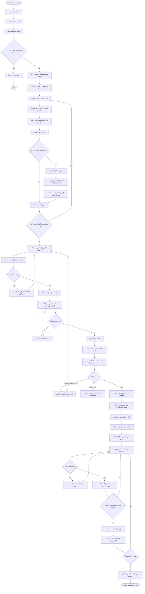
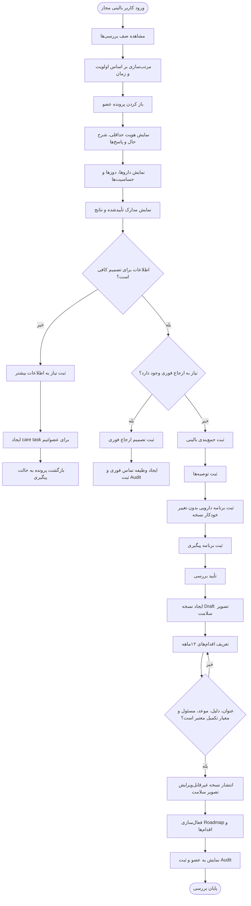
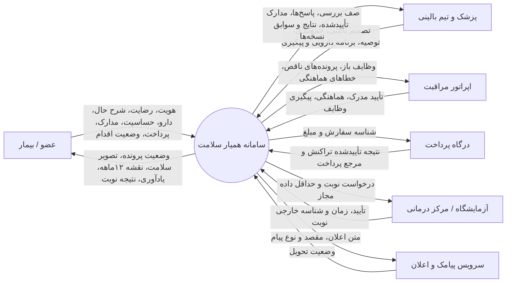
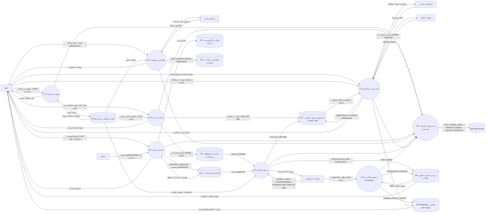

# فلوچارت و DFD سامانه همیار سلامت

نسخه: ۱.۰ — منطبق با MVP فعلی  
دامنه: سفر عضو، بررسی بالینی، تصویر سلامت، نقشه مراقبت ۱۲ماهه، پیگیری و نوبت‌دهی  
نکته: همه داده‌های نمونه در دمو ساختگی‌اند. این سند منطق محصول و جریان داده را توصیف می‌کند، نه پروتکل تشخیص یا درمان.

## ۱) فلوچارت اصلی سفر عضو



## ۲) فلوچارت پنل پزشک و تیم بالینی



## ۳) DFD سطح صفر — نمودار زمینه



## ۴) DFD سطح یک — فرآیندها و مخازن داده



## ۵) DFD سطح دو — ارزیابی، تریاژ و بررسی پزشک

```mermaid
flowchart TD
    M[عضو]
    C[پزشک]
    QD[(تعریف فعال پرسشنامه)]
    QR[(پاسخ و Answerها)]
    DOC[(مدارک approved)]
    CT[(Care Tasks)]
    CR[(Clinical Reviews)]
    HP[(Health Pictures)]
    AU[(Audit Events)]

    P21((2.1 دریافت پاسخ‌ها))
    P22((2.2 اعتبارسنجی ساختار و الزامات))
    P23((2.3 محاسبه Red Flag))
    P24((2.4 ثبت نسخه پاسخ))
    P25((2.5 ایجاد مسیر فوری یا عادی))
    P51((5.1 تجمیع پرونده))
    P52((5.2 تصمیم پزشک))
    P53((5.3 ساخت تصویر سلامت Draft))

    QD -->|question id، نوع پاسخ، نسخه| P21
    M -->|answer value، دارو، حساسیت، تأیید نهایی| P21
    P21 --> P22
    P22 -- نامعتبر -->|خطاهای فیلدی| M
    P22 -- معتبر --> P23
    P23 -->|red flag count و priority| P24
    P24 -->|response، answers، submittedAt| QR
    P24 --> P25
    P25 -- urgent -->|urgent_contact / due now| CT
    P25 -- normal -->|review_pending| CR
    P25 -->|ثبت submit و outcome| AU

    QR -->|آخرین پاسخ معتبر| P51
    DOC -->|مدرک کنترل‌شده| P51
    CT -->|وظایف باز مرتبط| P51
    P51 -->|پرونده حداقلی موردنیاز| C
    C -->|approve_draft / needs_follow_up / urgent_referral| P52
    P52 -->|decision و notes| CR
    P52 -- needs_follow_up -->|درخواست تکمیل اطلاعات| CT
    P52 -- urgent_referral -->|وظیفه بستن حلقه ارجاع| CT
    P52 -- approve_draft --> P53
    P53 -->|version، summary، recommendations، medicationPlan، followUpPlan، approvedBy| HP
    P52 -->|actor، purpose، outcome| AU
```

## ۶) وضعیت‌های اصلی رکوردها

| رکورد | چرخه وضعیت پیشنهادی/فعلی |
|---|---|
| عضو | `started → completed` |
| پاسخ پرسشنامه | `submitted → review_pending → reviewed` یا `urgent` |
| مدرک پزشکی | `quarantined → approved / rejected` |
| سفارش | `created → paid / failed / refunded`؛ در MVP: `paid_test` |
| اشتراک | `active → expired / cancelled`؛ در MVP: `active_test` |
| بررسی بالینی | `pending → completed` با decision مستقل |
| تصویر سلامت | `draft → published`؛ هر اصلاح، نسخه جدید |
| Roadmap | `active → completed / superseded`؛ هر انتشار، نسخه جدید |
| اقدام Roadmap | `pending → completed` با Action Update و evidence |
| نوبت | `requested → confirmed / manual_pending / failed / cancelled` |
| Care Task | `open → completed` |

## ۷) فرهنگ داده و محل نگهداری

| کد | مخزن | داده‌های کلیدی | مالک نوشتن | مصرف‌کنندگان |
|---|---|---|---|---|
| D1 | D1/SQLite | member، consent definition، user consent، journey profile | عضو و سرویس عضویت | همه فرایندهای مجاز |
| D2 | D1/SQLite | questionnaire definition، response، answer، redFlagCount | عضو/موتور ارزیابی | پزشک، تریاژ |
| D3 | D1/SQLite + R2 | metadata، checksum، objectKey، status و فایل اصلی | عضو؛ تصمیم وضعیت توسط اپراتور بالینی | پزشک، کنترل کیفیت |
| D4 | D1/SQLite | plan، order، payment attempt، subscription | سرویس تجارت/درگاه | کنترل دسترسی خدمت |
| D5 | D1/SQLite | clinical review، decision، notes، health picture version | پزشک مجاز | عضو و تیم مراقبت |
| D6 | D1/SQLite | roadmap، action، dueDate، ownerType، completionRule، evidence | پزشک و عضو | داشبورد و پیگیری |
| D7 | D1/SQLite | care task، provider، integration، appointment، reminder preference | سیستم، اپراتور و عضو | عملیات مراقبت |
| D8 | D1/SQLite | actorId، subjectId، action، resource، purpose، outcome، timestamp | همه فرایندهای حساس | ممیزی و امنیت |

## ۸) قواعد کنترلی ضروری

1. هیچ خروجی بالینی بدون `clinical review` تکمیل‌شده و `approvedBy` منتشر نمی‌شود.
2. فایل پزشکی ابتدا با وضعیت `quarantined` ذخیره می‌شود و فقط نسخه `approved` وارد تصمیم پزشک می‌شود.
3. رضایت‌ها نسخه‌دارند؛ نوع رضایت، نسخه متن، زمان اعطا و منبع ثبت می‌شود.
4. حساسیت دارویی و فهرست دارو همراه دوز، بخشی از ورودی اجباری بررسی پزشک است.
5. وجود red flag خروجی تشخیصی تولید نمی‌کند؛ مسیر فوری، وظیفه تماس و پیام اقدام اضطراری می‌سازد.
6. `idempotencyKey` مانع ایجاد پرداخت و اشتراک تکراری می‌شود.
7. تصویر سلامت و Roadmap پس از انتشار درجا ویرایش نمی‌شوند؛ اصلاحات با نسخه جدید ثبت می‌شوند.
8. هر خواندن/نوشتن حساس باید با نقش، هدف استفاده و رویداد ممیزی قابل ردیابی باشد.
9. ارسال به ارائه‌دهنده بیرونی فقط پس از رضایت هماهنگی و با حداقل داده لازم انجام می‌شود.
10. اطلاعات کارت، OTP و رمزهای اتصال در مخازن بالینی ذخیره نمی‌شوند.

## ۹) مرز MVP و نسخه عملیاتی

- در دموی فعلی، OTP، پرداخت، ارائه‌دهنده و پیامک در حالت آزمایشی/شبیه‌سازی‌شده‌اند.
- داده‌های اصلی ساختاریافته در D1 نگهداری می‌شوند و فایل‌های پزشکی برای R2 طراحی شده‌اند.
- پنل پزشک، تأیید مدرک، بررسی بالینی، تصویر سلامت نسخه‌دار و Roadmap در مدل داده MVP وجود دارند.
- برای نسخه عملیاتی باید اتصال واقعی OTP، پرداخت، پیامک، ذخیره‌سازی امن فایل، SLA تریاژ و کنترل دسترسی سازمانی فعال شود.
