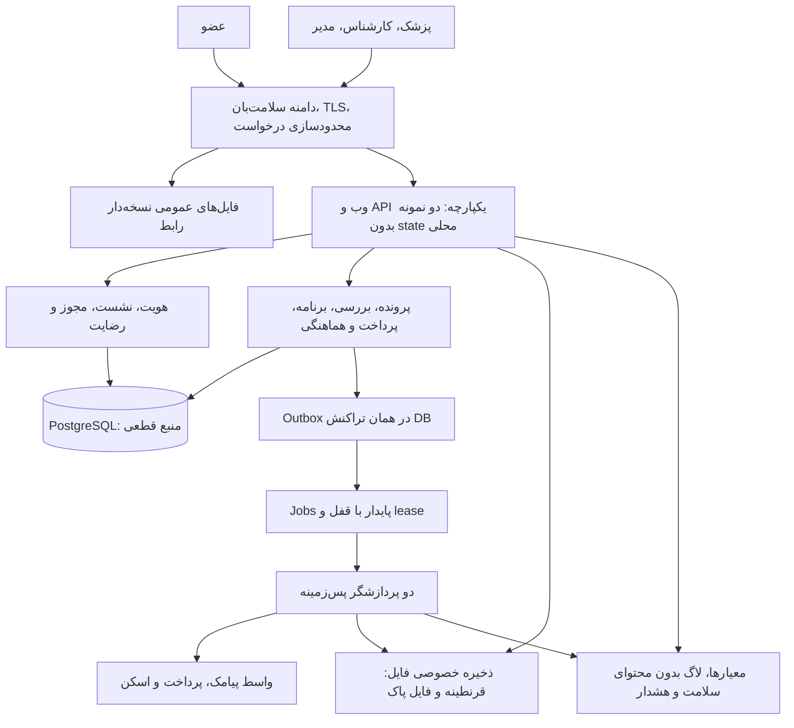
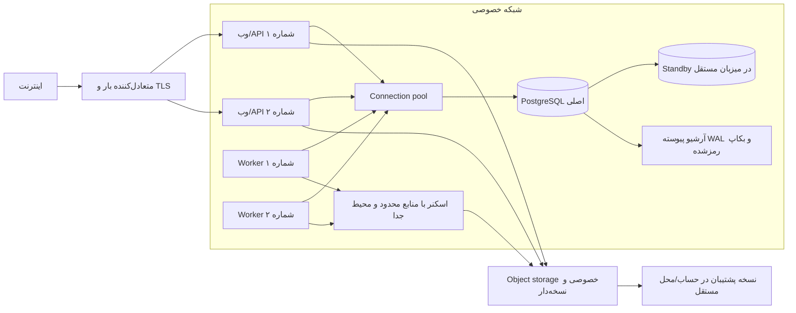
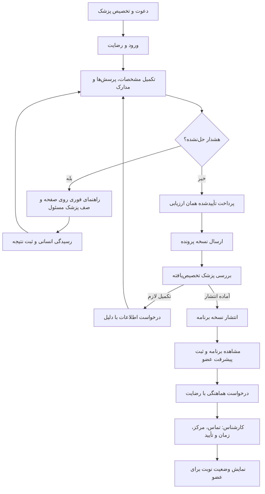

# معماری اجرایی سلامت‌بان برای ۱۰۰۰ کاربر فعال

نسخه سند: ۱٫۰ — ۱۴ مهر ۱۴۰۵ / ۶ اکتبر ۲۰۲۶
وضعیت: **طرح هدف برای توسعه و ارزیابی ظرفیت؛ هنوز در محصول مستقر نشده است.**

این سند، نقطه شروع برنامه‌نویس برای تبدیل نسخه نمایشی به سامانه مشترک چندکاربره است. «۱۰۰۰ کاربر» یک فرض طراحی و معیار آزمون است؛ اجرای آزمون ظرفیت، استقرار PostgreSQL یا آماده‌بودن بهره‌برداری با انتشار این سند ادعا نمی‌شود. طرح پایگاه داده، قیدها و دستور ساخت در دو فایل همراه آمده‌اند:

- [مدل کامل داده، روابط، مهاجرت و کوئری‌ها](database-1000-users-fa.md)
- [طرح پیشنهادی PostgreSQL](postgresql-target-schema.sql)
- [راهنمای سورس فعلی و اجرای نمونه](../DEVELOPER-HANDOFF-fa.md)
- [دامنه فعلی محصول و موارد باز](../salamatban-product-architecture-fa.md)

شاهد بررسی طرح دیتابیس: [گزارش ۷۵ بررسی موفق روی PostgreSQL 17.11](../architecture-database-validation.json). روش تکرار در انتهای سند دیتابیس آمده است؛ این گزارش آزمون ظرفیت API یا استقرار عملیاتی نیست.

## ۱. قرارداد ظرفیت و محدوده خدمت

«عضو فعال»، «کاربر فعال روزانه» و «کاربر هم‌زمان» یکی نیستند. برای برآورد محافظه‌کارانه این طراحی، ظرفیت تجاری اولیه ۱۰۰۰ عضویت فعال/دعوت‌شده و بار آزمایشی حداکثر ۱۰۰۰ کاربر یکتای روزانه در نظر گرفته می‌شود. حساب‌های کارکنان جدا هستند. تغییر این فرض، ورودی جدید آزمون ظرفیت خواهد بود.

| پارامتر | فرض یا هدف پیشنهادی |
|---|---|
| ظرفیت پذیرش اولیه | ۱۰۰۰ عضویت فعال، شامل دعوت پذیرفته‌نشده‌ای که جای آن رزرو شده است؛ قابل تنظیم و دارای کنترل هم‌زمانی |
| بار روزانه طراحی | ۱۰۰۰ DAU × میانگین ۱۰۰ درخواست پویای HTTP = ۱۰۰٬۰۰۰ درخواست در روز؛ فایل، فونت و سایر دارایی‌های CDN خارج این شمارش |
| هم‌زمانی پایه آزمون | ۱۰۰ نشست کاربری در حال تعامل؛ بازبودن ۱۰۰ تب به‌تنهایی به معنی ۱۰۰ درخواست هم‌زمان نیست |
| بار پایدار آزمون | ۴۰ درخواست پویای HTTP در ثانیه برای ۶۰ دقیقه، با ترکیب و زمان مکث تعریف‌شده در بخش آزمون |
| جهش کوتاه آزمون | ۸۰ درخواست پویای HTTP در ثانیه برای ۵ دقیقه؛ این عدد توان اندازه‌گیری‌شده سرور نیست |
| سناریوی مجزا | ۱۰۰۰ کاربر هم‌زمان؛ نیازمند آزمون مستقل و احتمال افزایش منابع، اتصال‌های DB و ظرفیت سرویس‌دهندگان |
| فایل | حداکثر ۱۰ جایگاه فایل جاری برای هر پرونده، هر فایل حداکثر ۱۰ MiB، فقط PDF/JPEG/PNG مطابق کنترل واقعی محتوا |
| دامنه محصول | ارزیابی اولیه، بررسی پزشک، برنامه پیگیری، ثبت پیشرفت، هماهنگی انسانی نوبت، پرداخت خدمت و پشتیبانی |

۱۰۰٬۰۰۰ درخواست در ۸ ساعت فعالیت، میانگین حدود ۳٫۵ درخواست در ثانیه است؛ انتخاب ۴۰ و ۸۰ برای تمرین تراکم ورود و جهش است، نه برآورد رفتار مشاهده‌شده کاربران. سقف ۱۰۰۰ حساب با کنترل `service_capacity` و `memberships` اعمال می‌شود؛ اضافه‌کردن منابع سرور این سقف تجاری را خودکار تغییر نمی‌دهد. در کد فعلی هنوز سقف پایلوت **۵۰ عضو** در `site/lib/pilot/service.ts` و `site/drizzle-pilot/0001_guards.sql` وجود دارد؛ این سند آن را تغییر نداده است.

اشتراک ۳/۶/۹/۱۲ماهه، پیام‌رسانی پزشکی، اتصال خودکار مراکز، CRM، تشخیص خودکار، نسخه‌نویسی و خدمات شبانه‌روزی جزو خروجی ساخته‌شده این معماری نیستند. یادآوری و اشتراک می‌توانند بعداً با قرارداد محصول و مدل داده جدا اضافه شوند؛ نبود آن‌ها نباید با دکمه یا پاسخ موفق ساختگی پوشانده شود.

## ۲. وضعیت موجود و تصمیم معماری هدف

| بخش | موجود در مخزن/لینک فعلی | هدف این طراحی |
|---|---|---|
| رابط | React، TypeScript، Vinext/Vite، فارسی RTL، قلم پیدا، انتخابگر شمسی | حفظ رابط و قرارداد تجربه؛ تفکیک ماژول‌ها، دسترس‌پذیری و آزمون دستگاه واقعی |
| نمایش عمومی | SQLite/WASM و IndexedDB داخل مرورگر؛ داده بین دستگاه‌ها مشترک نیست | فقط محیط نمایش با داده ساختگی؛ هرگز دیتابیس عملیاتی |
| مسیر سروری موجود | `handlePilot` روی Workers با D1 و R2؛ اتصال به SMS/درگاه/اسکن در کد | مسیر API روی Node.js و PostgreSQL، ذخیره خصوصی سازگار با S3؛ تبدیل با adapter و آزمون قرارداد |
| داده | ۱۴ جدول `pilot_*`، بخشی از محتوا JSON، فرم و برنامه نسخه‌دار | ۲۷ جدول هدف؛ تاریخچه رضایت/تخصیص/پرونده، پرداخت و کارهای پس‌زمینه مستقل |
| عملیات | گردش عضو/پزشک/کارشناس و کنترل‌های اولیه قابل آزمون | پایش، بازیابی، صف پایدار، حسابرسی، رسیدگی ابهام سرویس‌دهنده و رویه پشتیبانی |

تصمیم پیشنهادی، **یک برنامه یکپارچه با ماژول‌های مشخص** است. کد دامنه مشترک می‌ماند، اما فرایند وب/API و پردازشگر پس‌زمینه جدا اجرا و مقیاس داده می‌شوند. برای این مقیاس، جداکردن هر ماژول به سرویس شبکه‌ای مستقل توجیه اولیه ندارد. PostgreSQL منبع قطعی داده تراکنشی است؛ کش یا فایل JSON منبع حقیقت نمی‌شود. میزبان وابسته به فروشنده خاص نیست؛ هر مقصد باید اجرای Node/container، PostgreSQL، ذخیره خصوصی، شبکه امن و پشتیبان قابل بازیابی داشته باشد.

عدد ۱۰۰۰ کاربر به‌تنهایی ثابت نمی‌کند D1 یا Workers ناکافی است. حفظ Workers/D1/R2، اگر دسترسی شبکه، محل داده، backup، محدودیت سرویس و آزمون بار مقصد قابل قبول باشند، گزینه‌ای با بازنویسی کمتر است. پیشنهاد PostgreSQL در این سند به دلیل استقلال محل استقرار، کنترل تراکنش/قفل و worker، ابزارهای بازیابی و آشنایی تیم توسعه است؛ هزینه آن ساخت adapter، مهاجرت و عملیات بیشتر است. انتخاب نهایی با نتیجه آزمون و قابلیت میزبان انجام شود، نه با این فرض که تغییر فناوری خودبه‌خود ظرفیت ایجاد می‌کند.

Vinext و bindingهای فعلی Cloudflare مستقیماً سازگارکننده PostgreSQL/Node نیستند. تیم باید ورودی HTTP روی Node و repositoryهای PostgreSQL را بسازد، وابستگی `cloudflare:workers` را از منطق دامنه بیرون بکشد و آزمون‌های قرارداد را تکرار کند. نگه‌داشتن رابط React به معنی قابل اجرا بودن بدون تغییر همه بخش سرور روی هاست اشتراکی نیست. هاست اشتراکی صرفاً برای خروجی ایستای دمو کافی است.

## ۳. نمودار منطقی و استقرار





دو نمونه وب فقط خرابی یک فرایند یا میزبان وب را پوشش می‌دهند؛ **پایگاه داده تک‌نمونه، load balancer تک‌میزبان، ذخیره‌ساز یا شبکه مشترک همچنان نقطه شکست‌اند**. HA به Standby واقعی، تشخیص خرابی، جلوگیری از دو primary و آزمون failover احتیاج دارد. اجرای دو کانتینر روی یک VPS تحمل خرابی آن VPS ایجاد نمی‌کند. اگر مقصد DB مدیریت‌شده با HA ندارد، باید این ریسک صریح پذیرفته و هدف دسترس‌پذیری با آزمون بازیابی بازنگری شود؛ صرف داشتن بکاپ، HA نیست.

مبدأ رابط و API یکی باشد؛ پیشنهاد مسیر API زیر همان دامنه است. دامنه/CDN نمایش جدا از محیط واقعی بماند. فقط فایل‌های عمومی با نام دارای hash کش طولانی بگیرند؛ پاسخ‌های احراز هویت، پرونده و دانلود `private, no-store` داشته باشند. service worker نباید پرونده یا فایل پزشکی را برای استفاده آفلاین کش کند. محیط توسعه، staging و production حساب، secret، DB و bucket جدا داشته باشند.

## ۴. ماژول‌ها و مسئولیت کد

ساختار مقصد زیر **پیشنهاد برای ایجاد** است و جای فایل‌های موجود معرفی نمی‌شود:

```text
apps/web/                    رابط React و مسیریابی
apps/api/                    ورودی HTTP روی Node، schema ورودی و middleware
apps/worker/                 dispatcher و handler کارهای پس‌زمینه
packages/domain/identity/   حساب، نقش، نشست، محدودسازی
packages/domain/records/    رضایت، پرونده، بازبینی و انتشار
packages/domain/plans/      برنامه نسخه‌دار، اقدام و پیشرفت
packages/domain/documents/  رزرو بارگذاری، قرنطینه، مجوز دانلود
packages/domain/billing/    ارزیابی، سفارش، پرداخت، مغایرت و بازپرداخت
packages/domain/operations/ نوبت، پشتیبانی و مسئول کار
packages/infra/postgres/    repository، تراکنش و مهاجرت
packages/infra/providers/   پیامک، درگاه، ذخیره فایل و اسکن
packages/contracts/        schema ورودی/خروجی و OpenAPI نسخه‌دار
```

هر ماژول مالک نوشتن جدول‌های خودش است. درخواست بالینی می‌تواند در یک تراکنش چند ماژول را از طریق سرویس کاربردی هماهنگ کند؛ endpoint نباید SQL ماژول دیگر را کپی کند. عملیات خارجی داخل تراکنش یا قفل DB منتظر شبکه نمی‌ماند. اتصال سرویس‌دهنده از طریق واسط‌هایی مانند `SmsGateway`، `PaymentGateway`، `PrivateObjectStore` و `MalwareScanner` انجام می‌شود؛ mock فقط در آزمون/دمو فعال است و production با پیکربندی ناقص متوقف می‌شود.

منطق قابل انتقال در `site/lib/pilot/domain.ts`، `intake.ts` و بخش‌های `service.ts` است. `site/app/pilot/` رابط موجود، `site/db/pilot-schema.ts` مدل فعلی و `site/demo/` سازگارکننده مخصوص نمایش‌اند. در مهاجرت، سرویس دامنه به `Request/Response` مرورگر، SQL مربوط به D1 یا متغیرهای محیطی فروشنده وابسته نماند. دستورهای فعلی اجرای محلی در راهنمای تحویل هستند؛ این سند فرمان deploy ساختگی برای هدفی که هنوز پیاده نشده ارائه نمی‌کند.

## ۵. مالکیت، نشست و مرز دسترسی

| نقش | دسترسی هدف | مجوزی که ندارد |
|---|---|---|
| عضو | پروفایل، پرونده، مدارک، پرداخت، برنامه منتشرشده و درخواست‌های خودش | پرونده عضو دیگر یا پیش‌نویس داخلی پزشک |
| پزشک | پرونده و مدارک اعضای دارای تخصیص فعال، درخواست تکمیل و انتشار | پرونده بدون تخصیص؛ دسترسی با حدس شناسه |
| کارشناس | نام/تماس، رضایت هماهنگی و جزئیات لازم نوبت‌های تحت مسئولیت | پاسخ بالینی، نتیجه آزمایش، فایل یا متن کامل برنامه |
| مدیر | ظرفیت، دعوت، تعلیق، نقش، تخصیص، مالی و صف پشتیبانی | مجوز پیش‌فرض خواندن محتوای پزشکی |

هویت، عضویت فعال، نقش، مالکیت/تخصیص، هدف دسترسی، رضایت و وضعیت گردش کار **در هر درخواست سرور** دوباره کنترل شوند. `care_assignments` تاریخچه تخصیص را نگه می‌دارد؛ انتقال پزشک، مجوز درخواست بعدی پزشک قبلی را قطع می‌کند. فهرست‌ها نیز باید پیش از صفحه‌بندی محدود شوند، نه اینکه داده همه اعضا دریافت و در مرورگر فیلتر شود. خروجی کارشناس projection مشخص دارد؛ پنهان‌کردن فیلد در رابط کافی نیست. حسابداری یا DBA عملیاتی هم نباید مجوز استفاده روزمره از محتوای سلامت تلقی شود.

ورود عضو با OTP یک‌بارمصرف و مدت کوتاه، هش‌شده، سقف تلاش و محدودیت هم‌زمان برای شماره و IP است. پیام خطا نباید وجود شماره در سامانه را افشا کند. ورود کارکنان MFA مستقل، راه بازیابی ثبت‌شده و حساب‌های شخصی می‌خواهد؛ secret عمومی مشترک میان کارکنان قابل قبول نیست. تغییر نقش، بازپرداخت، خروجی داده و تغییر تنظیمات حساس نیازمند ورود مجدد/step-up و حسابرسی‌اند. آستانه نیاز به تأیید دوم برای بازپرداخت با مسئول مالی تعیین شود؛ این کنترل در طرح فعلی خودکار ساخته نشده است.

نشست در `auth_sessions` به صورت digest ذخیره و cookie با `HttpOnly; Secure; SameSite=Lax` صادر شود؛ ترجیحاً با پیشوند `__Host-` و بدون `Domain`. مقدار خام session و OTP وارد log نشود. برای عضو، سقف مطلق ۷ روز و بی‌فعالیتی ۲۴ ساعت؛ برای کارکنان سقف مطلق ۱۲ ساعت و بی‌فعالیتی ۳۰ دقیقه، **پیش‌فرض پیشنهادی قابل تصمیم محصول** است. تعلیق، خروج و تغییر نقش نشست‌های مربوط را باطل کند. همه تغییرات first-party، Origin مجاز و CSRF لازم دارند؛ GET نباید state را تغییر دهد. مسیر callback سرویس‌دهنده استثنای محدود CSRF است و باید با قرارداد همان سرویس و تأیید server-to-server احراز شود.

در schema هدف، `expires_at` حد مطلق، `last_seen_at` آخرین فعالیت معتبر و `mfa_verified_at` شاهد زمان احراز دوم است. تمدید فعالیت فقط پس از بررسی فعال‌بودن حساب/نقش، انقضای مطلق، بی‌فعالیتی و لغونشدن نشست انجام شود؛ نشست منقضی با یک request دیرهنگام زنده نشود. secret مستقل MFA هر کارمند در secret store با کلید شناسه همان حساب نگهداری و هنگام نقش‌دادن/بازیابی طی فرایند ثبت‌شده ساخته شود؛ ستون timestamp جای credential امن را نمی‌گیرد. تازگی MFA برای عملیات حساس نیز در همان درخواست سرور سنجیده شود.

کد و schema با query پارامتری، اعتبارسنجی ورودی، CSP مناسب، محدودیت اندازه بدنه و کنترل نوع فایل همراه شوند. CORS عمومی برای API سلامت فعال نشود. مسئول میزبانی، منطقه داده، متن رضایت و مدت نگهداری باید پیش از ورود اطلاعات واقعی مشخص باشند؛ این سند انطباق حقوقی یا پزشکی خودکار ادعا نمی‌کند.

## ۶. داده، نسخه‌ها و قواعد تراکنشی

مدل دقیق ۲۷ جدول، ERD، کلیدها، indexها و قیدهای قابل اجرا در [سند پایگاه داده](database-1000-users-fa.md) است. جدول زیر مرز مسئولیت را خلاصه می‌کند:

| دامنه | جدول‌ها |
|---|---|
| هویت و ظرفیت | `app_users`, `user_roles`, `service_capacity`, `memberships`, `care_assignments`, `auth_otp_challenges`, `auth_sessions`, `rate_limit_buckets` |
| رضایت و پرونده | `consent_documents`, `consent_events`, `health_records`, `record_revisions` |
| مدارک | `documents`؛ فقط metadata و object key در DB، بایت در bucket خصوصی |
| مالی | `assessment_orders`, `payment_attempts`, `refunds` |
| برنامه | `care_plans`, `plan_actions`, `action_events` |
| عملیات | `coordination_tasks`, `task_events`, `support_tickets`, `support_messages` |
| زیرساخت تراکنشی | `audit_events`, `outbox_events`, `jobs`, `idempotency_keys` |

قواعدی که برنامه‌نویس باید با تراکنش و آزمون هم‌زمانی حفظ کند:

1. رزرو جایگاه عضو پس از قفل ردیف `service_capacity` انجام شود؛ دو دعوت موازی نباید نفر ۱۰۰۱ را وارد ظرفیت ۱۰۰۰ کنند. حساب پزشک باید نقش و وضعیت معتبر داشته باشد.
2. ذخیره پیش‌نویس از شماره نسخه قبلی استفاده کند. اگر نسخه عوض شده، `409 VERSION_CONFLICT` برگردد و متن کاربر برای ادغام/بارگذاری مجدد حفظ شود؛ بازنویسی خاموش مجاز نیست.
3. ارسال پرونده فقط با رضایت جاری، داده معتبر، پرداخت تأییدشده همان ارزیابی و نبود هشدار حل‌نشده انجام شود. ردیف پرونده، snapshot بازبینی، audit و outbox مرتبط در تراکنش واحد تغییر کنند.
4. انتشار برنامه، روی یک نسخه مشخص و تغییرناپذیر پرونده انجام شود. دو پزشک یا دو تب نمی‌توانند دو نسخه نهایی برای همان بازبینی بسازند. برنامه منتشرشده و اقدام‌های آن ویرایش خاموش نشوند؛ اصلاح با نسخه جدید و دلیل ثبت‌شده باشد.
5. پیشرفت عضو در `action_events` ثبت شود؛ برنامه مصوب را تغییر ندهد و به معنی تأیید پزشکی یا انجام قطعی خدمت نباشد.
6. مبلغ ریالی، نسخه قیمت و شناسه محصول از سرور می‌آیند. نتیجه بازگشت مرورگر یا webhook، به‌تنهایی پرداخت را موفق نمی‌کند؛ مرجع تراکنش باید توسط درگاه تأیید و با مبلغ/سفارش تطبیق شود. مجموع بازپرداخت قطعی از مبلغ پرداخت‌شده بیشتر نشود.
7. انتشار رویداد مربوط به عمل موفق با commit همان عمل ثبت شود. خرابی worker پس از commit نباید رویداد را گم کند و تکرار job نباید پرداخت، پیام یا برنامه تکراری بسازد.

تاریخ تولد و موعد اقدام از نوع `date` و قرارداد API آن `YYYY-MM-DD` میلادی است؛ نمایش و ورود شمسی توسط `site/lib/persian-date.ts` انجام می‌شود. زمان رخدادها `timestamptz` و API آن RFC3339 UTC است؛ نمایش عملیاتی در `Asia/Tehran`. زمان نوبت هدف باید timestamp به‌همراه timezone و متن تکمیلی باشد؛ رشته آزاد فعلی در مهاجرت بدون حدس به زمان قطعی تبدیل نشود. اصل داده قدیمی و علامت «نیازمند تأیید زمان» حفظ شود.

## ۷. قرارداد API هدف و سازگاری

API پیشنهادی `/api/v1` است. تا انتقال کامل رابط، یک adapter موقت `/api/pilot` رفتار فعلی را نگه دارد؛ سرویس جدید نباید هم‌زمان دو منطق مستقل کسب‌وکار داشته باشد. OpenAPI و schemaهای request/response باید در توسعه تولید، بازبینی و با آزمون مصرف‌کننده کنترل شوند؛ فایل OpenAPI اجرایی این نسخه هنوز ایجاد نشده است.

| مسیر پیشنهادی | قرارداد اصلی |
|---|---|
| `POST /auth/otp/request`, `POST /auth/otp/verify`, `POST /auth/logout`, `GET /me` | عدم افشای شماره؛ محدودسازی؛ MFA کارکنان پیش از نشست نهایی |
| `GET /records/me`, `PUT /records/me` | projection مجاز و نسخه؛ تغییر با `If-Match: "17"` یا adapter صریح `body.version`، نه هر دو با مقادیر متفاوت |
| `POST /records/me/submit` | نسخه پرونده، رضایت و سفارش؛ پاسخ وضعیت/نسخه تازه |
| `POST /documents/uploads`, `POST /documents/:id/finalize` | رزرو جایگاه و مجوز کوتاه بارگذاری؛ بررسی مستقل فایل و ورود به قرنطینه |
| `GET /documents/:id/download` | کنترل مجوز تازه و clean بودن؛ صدور دسترسی کوتاه به نسخه دقیق object یا stream امن |
| `POST /assessment-orders`, `GET /assessment-orders/:id` | کلید تکرار امن، قیمت سرور؛ در صورت آماده‌نبودن درگاه `202` و وضعیت قابل پیگیری |
| `GET /payments/:provider/return` | بازگشت غیرقابل اعتماد مرورگر درگاه؛ صفحه «در حال بررسی» و ارجاع به وضعیت سفارش؛ پارامترهای `Authority`/`Status` شاهد پرداخت نیستند |
| `POST /payments/:provider/events` | اعتبارسنجی قرارداد callback، جلوگیری replay، ثبت دریافت، verify مستقل؛ بدون اعتماد به status مرورگر |
| `GET /staff/reviews`, `GET /staff/records/:id` | فقط تخصیص فعال، فیلتر server-side، cursor و `limit` حداکثر ۱۰۰ |
| `POST /staff/records/:id/request-information`, `POST /staff/records/:id/plans` | نسخه و دلیل/محتوا، اجازه پزشک، انتشار اتمی |
| `POST /plans/:id/actions/:actionId/events` | مالک، نسخه برنامه، شناسه تکرار امن و تاریخچه پیشرفت |
| `POST /coordination-tasks`, `POST /staff/coordination-tasks/:id/events` | رضایت، مسئول، وضعیت مجاز و مدرک تأیید؛ بدون محتوای بالینی اضافه |
| `POST /support-tickets`, `POST /support-tickets/:id/messages` | مالکیت، دسته درخواست و کنترل پیوست/متن؛ بستن درخواست معادل انجام حذف یا بازپرداخت نیست |
| `POST /admin/memberships`, `PUT /admin/memberships/:id` | ظرفیت، تعلیق، نقش و حسابرسی؛ تغییر ظرفیت با مجوز مجزا |

پاسخ خطا شکل ثابت `{error: {code, message, requestId, fieldErrors?}}` داشته باشد. خطاهای ورودی `422`، نیاز به ورود `401`، مجوز `403` یا `404` برای پنهان‌کردن منبع، تعارض نسخه `409`، محدودیت `429` با `Retry-After` و اختلال وابستگی `503` هستند. جزییات SQL، secret یا محتوای پرونده وارد پاسخ خطا نمی‌شود. client نباید پس از خطای شبکه عملیات غیرقابل‌تکرار را با شناسه تازه تکرار کند.

بازگشت فعلی درگاه در `site/lib/pilot/service.ts` از نوع GET است؛ adapter مهاجرت باید این قرارداد را حفظ کند. در هدف، GET بازگشت فقط نتیجه/وضعیت را نمایش می‌دهد و صفحه مجاز کاربر یا reconciler سروری، verify را با روش امن انجام می‌دهد؛ پرداخت صرف رسیدن GET تغییر نمی‌کند. endpoint مستقل POST رویداد فقط وقتی فعال می‌شود که سرویس‌دهنده webhook معتبر پشتیبانی کند. endpoint بیرونی به session/CSRF مرورگر کاربر متکی نیست، ولی ورودی محدود، احراز قرارداد سرویس، محدودیت نرخ و verify server-to-server لازم دارد؛ نبود امضای معتبر را با اعتماد به پارامتر مرورگر جبران نکنید.

کلید `Idempotency-Key` برای ساخت سفارش، refund، درخواست هماهنگی و عملیات job ذخیره شود؛ scope شامل actor، نوع عمل و کلید است و hash بدنه درخواست را هم نگه دارد. تکرار همان کلید/همان بدنه نتیجه قبلی را برگرداند؛ همان کلید با بدنه متفاوت `409` بدهد. مدت نگهداری مطابق طول عمر خطر تکرار باشد؛ پاک‌کردن زودهنگام این کلیدها نباید راه پرداخت تکراری باز کند. callback تکراری علاوه بر کلید نرم‌افزاری با مرجع یکتای مالی کنترل شود.

## ۸. چرخه مدرک و فایل خصوصی

۱. سرور پس از احراز هویت، رضایت و وضعیت پرونده، ردیف پرونده را قفل و یکی از ۱۰ جایگاه را رزرو می‌کند؛ فایل‌های در حال بارگذاری و قرنطینه نیز جایگاه مصرف می‌کنند. شناسه object تصادفی باشد؛ نام فایل کاربر کلید ذخیره‌سازی نمی‌شود.

۲. مجوز بارگذاری حداکثر چند دقیقه اعتبار، bucket/key مشخص و در صورت پشتیبانی محدودیت اندازه/content checksum دارد. امضاشدن URL به معنی امن‌بودن محتوای آن نیست. اگر سرویس S3 قیود اندازه یا رفتار مورد نیاز را قابل اتکا اجرا نمی‌کند، gateway محدودشده بارگذاری جایگزین شود. رزرو منقضی با job پاک شود؛ محدودیت تعداد بر مبنای تراکنش DB است، نه شمارش غیراتمی در UI.

۳. `finalize` فقط به ادعای مرورگر اعتماد نکند: وجود object، version ID، اندازه واقعی، checksum و نوع واقعی بایت‌ها بررسی و رکورد به قرنطینه منتقل شود. مصرف و اسکن به **همان نسخه غیرقابل تغییر object** مقید باشند تا بازنویسی بعد از اسکن ممکن نباشد. نسخه پاک در namespace/bucket جدا با نوشتن مختص worker نگهداری شود؛ key قرنطینه مستقیماً دانلود نشود.

۴. اسکنر جدا، با سقف CPU/حافظه/زمان و بدون دسترسی به secretهای برنامه عمل کند. timeout یا پاسخ نامطمئن برابر clean نیست؛ وضعیت در انتظار/قرنطینه باقی بماند و پس از تلاش محدود به صف عملیات برود. PDF و تصویر نیز ممکن است خراب یا خطرناک باشند؛ تشخیص header به‌تنهایی اسکن نیست.

۵. دانلود فقط پس از مجوز تازه عضو یا پزشک تخصیص‌یافته و وضعیت clean ممکن است. URL امضاشده bearer است و در log/analytics ثبت نشود؛ اعتبار پیشنهادی حداکثر ۶۰ ثانیه، `Content-Disposition: attachment` و `no-store`. لغو تخصیص، صدور URL تازه را متوقف می‌کند ولی URL صادرشده تا انقضا قابل استفاده است؛ اگر لغو آنی لازم باشد، دانلود از gateway احراز‌شده عبور کند. bucket و ACL هرگز عمومی نشوند.

۶. حذف منطقی، زمان‌بندی حذف بایت/نسخه‌ها و سیاست نگهداری هماهنگ باشند. حذف از UI به معنی پاک‌شدن بکاپ نیست. پس از restore، فهرست حذف‌های قطعی و محدودیت نگهداری دوباره اعمال شود؛ مدت دقیق پزشکی/مالی باید مصوب باشد و از عدد تصادفی استفاده نشود.

## ۹. کار پس‌زمینه، سرویس‌دهنده و خرابی

در شروع، صف پایدار PostgreSQL با `outbox_events` و `jobs` کافی است؛ Redis الزامی نیست. workerها با `FOR UPDATE SKIP LOCKED`، lease زمان‌دار و شناسه claim کار را می‌گیرند. تحویل **حداقل یک بار** است؛ claim، اثر خارجی و ثبت نتیجه نمی‌توانند «دقیقاً یک بار» بین دو سامانه مستقل تضمین شوند. هر handler باید تکرارپذیر و اثر خارجی دارای کلید/مرجع ثابت باشد. اگر سرویس‌دهنده کلید تکرار امن ندارد، lookup/reconcile پیش از تکرار write انجام شود.

رویداد فقط شناسه‌ها و metadata لازم دارد؛ متن پرونده یا فایل داخل queue/log کپی نشود. claim کوتاه‌مدت، heartbeat برای کار طولانی، آزادسازی پس از انقضا، سقف تلاش، backoff با jitter و صف رسیدگی انسانی لازم‌اند. پیشنهاد اولیه برای کارهای عادی: حداکثر ۵ تلاش با فاصله‌های حدود ۳۰ ثانیه، ۲، ۱۰، ۳۰ و ۶۰ دقیقه؛ درگاه سیاست مخصوص دارد. خطای اعتبارسنجی دائمی retry نمی‌شود.

OTP استثنای ارسال عمومی پس‌زمینه است: کد تصادفی فقط در حافظه فرایند ورود ساخته، digest/HMAC آن با مهلت و شمار تلاش در DB commit و سپس همان فرایند با timeout کوتاه پیامک را ارسال می‌کند. OTP خام داخل `jobs`، `outbox_events` یا DB ذخیره نمی‌شود؛ worker نمی‌تواند از digest کد را بازسازی کند. شکست/ابهام ارسال به ابطال همان challenge و درخواست تازه کنترل‌شده منجر شود؛ شمارنده محدودسازی پاک نشود. ارسال دیرهنگام پیامک قبلی ممکن است رخ دهد ولی challenge باطل‌شده قابل ورود نباشد. ارسال یادآوری غیر OTP از worker با شناسه منبع و projection حداقلی انجام می‌شود.

| اختلال | رفتار درست و اقدام عملیات |
|---|---|
| پیامک قطع | نشست معتبر موجود ادامه دارد؛ ورود تازه وضعیت اختلال دارد؛ نمایش کد ورود یا دورزدن OTP در production ممنوع؛ هشدار مسئول سرویس |
| درگاه timeout پس از درخواست | سفارش در وضعیت نامشخص/مغایرت باقی می‌ماند؛ همان authority/مرجع بررسی می‌شود؛ پرداخت تازه از کاربر مطالبه نمی‌شود |
| callback تکراری/گم‌شده | پردازش idempotent؛ reconciliation مستقل از callback، مثلاً هر ۵ دقیقه برای موارد باز؛ مغایرت بیش از ۳۰ دقیقه به مسئول مالی |
| اسکنر قطع | فایل قرنطینه و غیرقابل دانلود؛ صفحه وضعیت واقعی را نشان می‌دهد؛ ثبت سایر بخش‌های پرونده در حد قواعد کسب‌وکار ادامه دارد |
| worker قطع | تراکنش و outbox در DB می‌مانند؛ worker دیگر lease منقضی را می‌گیرد؛ هشدار تأخیر صف، بدون موفقیت ساختگی |
| PostgreSQL قطع | API خطای قابل بازیابی `503`؛ هیچ ذخیره موفق اعلام نمی‌شود؛ session مرورگر مجوز آفلاین نمی‌سازد؛ failover کنترل‌شده یا restore |
| ذخیره فایل قطع | پروفایل/برنامه مستقل از فایل قابل دسترسی می‌ماند؛ upload/download وضعیت اختلال دارد؛ object ناقص clean نمی‌شود |
| پزشک/کارشناس غایب | صف دارای deadline و مسئول جانشین؛ انتقال کار ثبت‌شده، بدون انتشار خودکار نتیجه بالینی |

مهلت پیشنهادی request خارجی ۱۰ تا ۱۵ ثانیه و اسکن ۳۰ ثانیه است؛ در صورت عملیات طولانی از job و وضعیت قابل پیگیری استفاده شود. سیاست واقعی باید با محدودیت سرویس‌دهنده تنظیم شود. قطع مدار (circuit breaker) per-provider، kill switch پذیرش/پرداخت و داشبورد مغایرت لازم‌اند. کار تأیید نوبت فقط با مرکز، زمان معتبر، کد/شاهد تأیید و رضایت همان انتقال اطلاعات انجام می‌شود؛ رسیدن پاسخ HTTP200 مبهم به معنی نوبت قطعی نیست.

## ۱۰. جریان عضو و مسئولیت انسانی



بازگشت برای تکمیل همان ارزیابی، خرید دوباره ایجاد نمی‌کند. انتشار اصلاحیه، نسخه قبلی را حفظ می‌کند. درخواست حذف/دریافت داده/بازپرداخت از پشتیبانی به کار اجرایی با مسئول، موعد و شاهد انجام تبدیل شود. بستن ticket، معادل حذف object یا وصول refund نیست. فایل خروجی داده مانند فایل بالینی خصوصی، کوتاه‌عمر و پس از احراز مجدد قابل دریافت باشد؛ export کامل باید حسابرسی شود.

ظرفیت فنی جای ظرفیت پزشک را نمی‌گیرد. برای نمونه، اگر روزانه ۵٪ از ۱۰۰۰ عضو پرونده آماده بررسی بسازند، ۵۰ بررسی در روز داریم؛ با فرض ۲۰ دقیقه برای هر بررسی، حدود ۱۶٫۷ ساعت کار بالینی روزانه لازم است، جدا از تکمیل اطلاعات و موارد هشدار. این فرض برای برنامه‌ریزی است، نه زمان اندازه‌گیری‌شده یا توصیه بالینی. سقف پذیرش باید بر اساس صف و ظرفیت تیم هم قابل کاهش باشد.

پیشنهاد قابل تصمیم برای عملیات: ۹۰٪ پرونده‌های کامل حداکثر طی ۲ روز کاری پاسخ اولیه بگیرند؛ ۹۵٪ درخواست‌های عادی هماهنگی/پشتیبانی طی ۱ روز کاری نخستین پاسخ بگیرند. مبدأ اندازه‌گیری، `submitted_at` پرونده کامل یا زمان ثبت درخواست است؛ ساعات کاری و تعطیلات باید در محصول ثبت شوند. هشدار بالینی فوراً راهنمای مصوب مراجعه فوری را روی صفحه نشان دهد؛ زمان تماس تیم و پوشش خارج ساعات باید توسط مسئول بالینی تعیین و در رابط اعلام شود. این سامانه وعده اورژانس یا پاسخ انسانی شبانه‌روزی نمی‌دهد.

## ۱۱. منابع اولیه و رشد

این جدول نقطه شروع **بدون benchmark** است؛ خرید یا تعهد ظرفیت بر مبنای آن به‌تنهایی انجام نشود. تنظیم نهایی با پروفایل آزمون بخش ۱۳ و کیفیت شبکه مقصد تعیین می‌شود.

| جزء | شروع پیشنهادی | قاعده رشد/کنترل |
|---|---|---|
| وب/API | ۲ نمونه، هرکدام ۲ vCPU و ۴ GiB RAM، روی میزبان‌های مستقل | نشست خارج فرایند؛ افزایش replica پس از بررسی DB؛ حد CPU/RAM و shutdown آرام |
| worker | ۲ نمونه، هرکدام ۱ vCPU و ۲ GiB RAM | concurrency محدود برای هر نوع job؛ اسکن داخل فرایند API اجرا نشود |
| اسکنر | فرایند/میزبان جدا، شروع ۲ vCPU و ۴ GiB RAM | سقف اندازه/زمان؛ تعداد اسکن هم‌زمان بر اساس حافظه و آزمون فایل |
| PostgreSQL | primary و standby هرکدام ۴ vCPU، ۸ GiB RAM، دیسک SSD اولیه ۱۰۰ GiB | مبنای طرح PostgreSQL 17؛ patch امنیتی جاری، تنظیم vendor و اندازه‌گیری IOPS |
| اتصال DB | نمونه وب حداکثر ۱۰ و worker حداکثر ۵ اتصال؛ مجموع پایه ۳۰، سقف pool برنامه ۴۰ | برای عملیات و failover جای خالی؛ شروع `max_connections=100` و pool مطابق مقصد؛ افزایش replica بدون اصلاح بودجه اتصال ممنوع |
| ذخیره فایل | خصوصی، نسخه‌دار، با lifecycle، checksum و اندازه‌گیری نرخ خروجی | افزایش مستقل از وب/DB؛ کنترل هزینه نسخه‌های حذف‌نشده و دانلود |

برآورد فایل برای ۱۰۰۰ عضو: متوسط فرضی ۶ فایل × ۳ MiB = حدود **۱۷٫۶ GiB فایل فعال**. سقف قرارداد ۱۰۰۰ × ۱۰ × ۱۰ MiB = حدود **۹۷٫۷ GiB فایل فعال**. اگر مجموع فایل فعال، نسخه‌های قبلی و یک کپی پشتیبان را معادل ۳ برابر فایل فعال فرض کنیم، حدود ۵۲٫۷ GiB در حالت متوسط و ۲۹۳ GiB در سقف مصرف نیاز داریم؛ ۲۰٪ فضای قرنطینه/انتقال نیز حدود ۳٫۵ یا ۱۹٫۵ GiB اضافه می‌کند. ضریب ۳ سیاست نگهداری محسوب نمی‌شود؛ تعداد نسخه، دوره نگهداری و رشد کاربران باید جدا اندازه‌گیری شوند.

برآورد DB برای برنامه‌ریزی: ۱۰۰۰ عضو × ۲ MiB مجموع profile/answer/snapshot/برنامه = حدود ۲ GiB داده بالینی ساختاریافته؛ فرض ۱۰۰٬۰۰۰ رویداد حسابرسی در روز × ۱ KiB × ۳۶۵ ≈ ۳۴٫۸ GiB در سال **پیش از index، WAL، TOAST و overhead**. اگر index و overhead مجموعاً همین مقدار دیگر بگیرند، حدود ۷۰ GiB فقط برای آن مسیر لازم می‌شود؛ به همین دلیل دیسک ۱۰۰ GiB آغاز است و رشد/آرشیو باید پایش شود. حجم و نگهداری audit با اندازه‌گیری واقعی و سیاست مصوب اصلاح شوند؛ همه HTTPها الزاماً audit بالینی نیستند و log برنامه جداست.

داده فقط با cursor صفحه‌بندی و projection لازم خوانده شود. صف پزشک روی تخصیص، وضعیت و زمان index دارد؛ job روی وضعیت/موعد؛ مدارک روی مالک و وضعیت؛ پرداخت روی سفارش/مرجع؛ رخدادها روی منبع و زمان. فهرست همه پرونده‌ها بدون limit یا بارگیری همه نسخه‌های برنامه در صفحه اول حذف شود. قبل از افزایش ماشین، `EXPLAIN (ANALYZE, BUFFERS)`، شمار query هر request، قفل‌ها و تراکنش‌های طولانی بررسی شوند. کش بالینی بین کاربران مشترک نشود؛ Redis یا read replica فقط پس از شواهد گلوگاه اضافه شود و مسیر مجوز/رضایت از داده عقب‌مانده تصمیم نگیرد.

## ۱۲. پایش، دسترس‌پذیری و بازیابی

هدف پیشنهادی دسترس‌پذیری APIهای اصلی، **۹۹٫۵٪ در ماه بر مبنای درخواست** است؛ تعریف آن نسبت درخواست‌های معتبر رسیدگی‌شده بدون `5xx`/timeout به کل درخواست‌های معتبر است. درخواست نامعتبر، لغو مشتری و محدودیت موجه `429` جدا گزارش شوند؛ حذف گسترده نمونه‌ها برای بهترکردن عدد مجاز نیست. اثر اختلال پیامک/پرداخت بر مسیر کامل کاربر نیز جدا سنجیده شود، حتی اگر API داخلی سالم باشد. این SLI مبتنی بر درخواست، مستقیماً به تعداد ساعت قطعی تبدیل نمی‌شود؛ دسترس‌پذیری زمانی با probe دوره‌ای مستقل و جدا گزارش شود. هدف SLA قراردادی نیست و پس از نیاز کسب‌وکار و نتیجه آزمون تغییر می‌کند.

داشبورد حداقل شامل p50/p95/p99 زمان API، نسبت 5xx، خطای ورود، سن قدیمی‌ترین job/outbox، تأخیر اسکن، سفارش نامشخص، صف پزشک/نوبت بر حسب deadline، pool wait، اتصال DB، slow query، قفل، lag standby/WAL و سن آخرین بکاپ موفق باشد. trace و `requestId` به audit متصل شوند؛ متن سلامت، شماره کامل، OTP، token، URL امضاشده و payload درگاه وارد telemetry نشوند. metricها شناسه عضو را label نکنند تا هم حریم داده و هم cardinality کنترل شود.

آستانه اولیه هشدار: 5xx بیش از ۱٪ طی ۵ دقیقه با حداقل ۱۰۰ درخواست، p95 داخلی بیش از یک ثانیه برای ۱۰ دقیقه، job عادی معوق بیش از ۵ دقیقه، مغایرت مالی بیش از ۳۰ دقیقه، پرشدن دیسک بیش از ۷۰٪ برای اقدام پیشگیرانه/۸۵٪ فوری، و عقب‌ماندگی پشتیبان بیشتر از RPO. آستانه اسکن و صف بالینی با ساعات خدمت تنظیم شوند. اعلان باید مالک، زمان پاسخ و جانشین داشته باشد؛ صرف نمودار بدون دریافت‌کننده کافی نیست.

**اهداف بازیابی پیشنهادی: RPO حداکثر ۱۵ دقیقه و RTO حداکثر ۴ ساعت.** RPO یعنی حداکثر داده تأییدشده قابل از دست‌رفتن؛ RTO از تشخیص حادثه تا بازگشت خدمت قابل استفاده و صحت‌سنجی است. بکاپ شبانه به‌تنهایی RPO پانزده‌دقیقه‌ای نمی‌دهد: base backup منظم و ارسال پیوسته WAL برای PITR، اندازه‌گیری lag و هشدار لازم‌اند. replica نیز جای بکاپ مستقل را نمی‌گیرد.

بکاپ DB و فایل‌ها رمز‌شده و با دسترسی جدا از برنامه، در حساب/مقصد مستقل مجاز نگهداری شوند. کلید رمز نیز باید قابل بازیابی و خارج از همان نقطه شکست باشد. نسخه‌داری object، جلوگیری از حذف گسترده و inventory شامل checksum/object version با بکاپ DB تطبیق داده شود. TLS برای مرورگر، DB و سرویس‌دهنده و رمزگذاری در حالت سکون الزامی‌اند؛ «قابلیت فروشنده» بدون پیکربندی و آزمون شاهد محسوب نمی‌شود.

RPO پانزده‌دقیقه‌ای **داده DB و بایت فایل را با هم** پوشش دهد: کپی مستقل objectها نیز باید حداکثر ۱۵ دقیقه عقب باشد و سن قدیمی‌ترین object تأییدشده‌ای که کپی نشده هشدار بدهد. watermark مشترک بازیابی، قدیمی‌ترِ زمان قابل بازیابی WAL و زمان تضمین‌شده فایل/نسخه‌های مرتبط است. در restore، manifest رکوردها به version/checksum فایل تطبیق داده شود؛ رکورد clean با object مفقود قابل دانلود یا «سالم» معرفی نشود. اگر مقصد این هماهنگی و lag را تضمین نمی‌کند، RPO واقعی کل سامانه بیشتر است و پیش از launch باید هدف یا زیرساخت اصلاح شود.

پیش از اولین عضو واقعی و سپس حداقل ماهانه restore به محیط جدا تمرین شود: زمان شروع حادثه، آخرین WAL، ایجاد DB، صحت تعداد ردیف/FK، تطبیق نمونه checksum فایل، ورود نقش‌ها، قطع دسترسی حساب معلق، نمایش برنامه و حفظ پرداخت ثبت شود. در restore، حذف‌های قطعی/رضایت‌های لغوشده بازاعمال، نشست‌ها در صورت نیاز باطل و workerها تا بررسی idempotency متوقف باشند؛ job بازیابی‌شده نباید refund یا پیام قدیمی را دوباره ایجاد کند. نتیجه واقعی تمرین باید RPO/RTO پیشنهادی را ثابت کند؛ تا آن زمان این‌ها هدف‌اند.

## ۱۳. برنامه آزمون و معیار قبولی ظرفیت

داده آزمون کاملاً ساختگی: ۱۰۰۰ عضو با تخصیص، رضایت و پرونده در وضعیت‌های متفاوت، تا ۱۰ فایل برای هر عضو، چند نسخه برنامه و حجم رویداد نزدیک نگهداری هدف. آزمون علیه staging هم‌ارز منابع مقصد انجام شود. در load test عمومی از SMS/پرداخت واقعی استفاده نشود؛ latency و failure سرویس‌دهنده با stub بازتولید شود و contract test واقعی جدا با حساب آزمون انجام شود.

| آزمون | معیار پذیرش پیشنهادی |
|---|---|
| عملکرد پایدار | ۴۰ درخواست پویا/ثانیه، ۶۰ دقیقه؛ ترکیب ۷۰٪ خواندن عضو، ۱۵٪ ذخیره فرم/پیشرفت، ۱۰٪ صف کارکنان، ۵٪ نشست/وضعیت سفارش |
| جهش و بازیابی | ۸۰ درخواست/ثانیه برای ۵ دقیقه؛ سپس بازگشت صف/latency به حالت عادی حداکثر ۵ دقیقه؛ بدون رشد مداوم حافظه/اتصال |
| latency داخلی | p95 خواندن کمتر از ۵۰۰ms و نوشتن کمتر از ۸۰۰ms از دریافت API تا پاسخ؛ p99 و شبکه انتهابه‌انتها هم گزارش شوند |
| خطا و صحت | خطای غیرمنتظره کمتر از ۰٫۵٪؛ صفر دسترسی بین دو عضو، انتشار/پرداخت تکراری، فایل clean تأییدنشده یا ذخیره گم‌شده |
| منابع | در بار پایدار CPU معمولاً کمتر از ۷۰٪، حافظه و pool بدون اشباع/رشد؛ پس از حذف یک وب‌نمونه بار پذیرفته و تأخیر اندازه‌گیری شود |
| upload/download | آزمون جدا با ۱۰ بارگذاری هم‌زمان ۱۰ MiB و شبکه محدود؛ اندازه/نوع/quota حفظ شود، throughput و مدت واقعی گزارش شود؛ مشمول p95 بدنه کوچک نیست |
| اختلال وابستگی | timeout درگاه، webhook تکراری، قطعی اسکن، مرگ worker بعد از اثر خارجی، failover DB و restore؛ هیچ موفقیت مبهم قطعی نشود |
| سناریوی ۱۰۰۰ هم‌زمان | جداگانه با arrival rate و think time مشخص، گزارش نقطه اشباع؛ قبولی ۱۰۰ نشست پایه شاهد این سناریو نیست |

در ابزار بار مانند k6، arrival rate درخواست و تعداد VU هر دو ثبت شوند؛ سقف ۱۰۰ VU نباید با کندشدن سرویس نرخ واقعی را کم و شکست را پنهان کند. درخواست‌های dropped، deadline و نرخ محقق‌شده گزارش شوند. ۱۰۰ کاربر هر ۵ ثانیه یک تعامل با ۴ درخواست می‌توانند ۸۰ درخواست/ثانیه ایجاد کنند، ولی ترکیب واقعی باید از رابط اندازه‌گیری شود. زمان انتظار سرویس خارجی از latency داخلی جدا گزارش شود و در سناریوی انتهابه‌انتها حذف نشود.

آزمون‌های فعلی `site/tests/pilot.test.mjs`، `site/tests/persian-date.test.mjs` و `site/demo/presentation.test.mjs` پایه رگرسیون‌اند؛ آن‌ها آزمون ظرفیت یا PostgreSQL production نیستند. هدف توسعه علاوه بر آن‌ها: integration روی PostgreSQL واقعی، migration از fixture D1، رقابت دو ثبت/انتشار/پرداخت/رزرو فایل، ماتریس نقش با شناسه عضو دیگر، رضایت لغوشده، زمان/شمسی/کبیسه، قرارداد gateway، آزمون accessibility و Android/iOS واقعی. یک بررسی مستقل امنیتی و مرور بالینی پیش از پذیرش داده واقعی انجام شود؛ وجود این بند گزارش انجام آن‌ها نیست.

## ۱۴. ساخت، مهاجرت و انتشار

CI باید نصب از lockfile، lint/typecheck، آزمون واحد و integration، ساخت رابط/API/worker، بررسی secret و وابستگی و ساخت image با digest ثابت را انجام دهد. همان artifact ابتدا به staging و سپس production برود؛ build جدا با خروجی ناشناخته در سرور اجرا نشود. secret فقط از secret store و با نقش کمینه تزریق شود. endpointهای health شامل liveness بدون وابستگی شبکه و readiness با بررسی کوتاه DB باشند؛ provider قطع‌شده نباید تمام replicaهای وب را هم‌زمان از load balancer حذف کند.

مهاجرت D1 به PostgreSQL یک پروژه واقعی است: استخراج سازگار، حفظ شناسه‌ها یا جدول نگاشت، تبدیل epoch به timestamp، اعتبارسنجی JSON، انتقال snapshotها و checksum فایل، گزارش مغایرت و آزمون readback. داده IndexedDB نمایش منبع معتبر کاربران واقعی نیست و به production وارد نمی‌شود. روش پیشنهادی برای حجم اولیه، rehearsal کامل روی نسخه ساختگی/مجاز، اعلام پنجره نگهداری کوتاه، توقف نوشتن، snapshot نهایی، import و اعتبارسنجی، تعویض route و بازگشایی است؛ dual-write بدون طرح reconciliation استفاده نشود.

برای انتشارهای بعدی از expand/backfill/contract استفاده شود: ستون/جدول سازگار افزوده شود، کد قدیم و جدید هم‌زمان قابل اجرا باشند، backfill دسته‌ای با resume اجرا و شمارش/قید بررسی شود، سپس خواندن به ساختار جدید تغییر کند؛ حذف ساختار قدیم در انتشار بعدی. migration توسط یک فرایند مجاز با قفل اجرا شود، نه هنگام start هر replica. برای index بزرگ روش concurrent و محدودیت lock بررسی شود.

بازگشت کد با artifact قبلی تا وقتی schema سازگار است ممکن است؛ down migration تخریبی راه عادی rollback نیست. restore DB پس از نوشتن جدید ممکن است داده/پرداخت را از دست بدهد و نیازمند توقف خدمت و reconciliation است. برای تغییر پرخطر feature flag با مالک و تاریخ حذف داشته باشید. flag کنترل مجوز یا رضایت را خاموش نکند. rollout ابتدا برای کارکنان/گروه کوچک و سپس ۵۰، ۲۵۰ و ۱۰۰۰ عضو انجام شود؛ هر مرحله به صحت مالی، صف تیم، تست و هدف خدمت وابسته است.

## ۱۵. Runbookهای لازم و تحویل برنامه‌نویس

| Runbook | گام‌های الزامی و شاهد پایان |
|---|---|
| اختلال API/DB | ثبت incident، توقف تغییرات، بررسی readiness/pool/قفل، failover با جلوگیری دو primary، smoke نقش‌ها و ثبت زمان بازیابی |
| مغایرت پرداخت | یافتن سفارش با requestId/authority، استعلام مستقل مبلغ/مرجع، تغییر idempotent، اطلاع بدون داده بالینی؛ هیچ تغییر مستقیم SQL بدون رد حسابرسی |
| فایل معوق/آلوده | مسدودماندن دانلود، بررسی نسخه/checksum، retry محدود یا رد با دلیل، پاکسازی طبق سیاست؛ استفاده از فایل روی لپ‌تاپ پشتیبان ممنوع |
| تأخیر پزشک/هماهنگی | فیلتر overdue، تعیین جانشین مجاز، ثبت انتقال و اطلاع حداقلی به عضو؛ گزارش تعداد/سن صف |
| حذف/دریافت داده | احراز مجدد، بررسی محدوده/نگهداری، تهیه خروجی خصوصی یا حذف قابل اثبات، ثبت object/version و اثر روی بکاپ؛ پایان با شاهد اجرا |
| بازپرداخت | کنترل سیاست/مجوز و سقف باقی‌مانده، ثبت درخواست یکتا، استعلام نتیجه، رسید و تطبیق مالی؛ پاسخ ticket به‌تنهایی کافی نیست |
| رخداد دسترسی/secret | محدودسازی مسیر، لغو نشست/کلید مرتبط، حفظ شواهد بدون انتشار سلامت، تعیین دامنه اثر و اطلاع طبق رویه مصوب، سپس رفع و مرور |

تحویل توسعه کامل این طرح باید شامل کد و migration هدف، OpenAPI نسخه‌دار، داده ساختگی و seed، تست قرارداد و هم‌زمانی، گزارش load test با مشخصات ماشین، شواهد restore، config نمونه بدون secret، dashboard/alert، runbookها و فهرست تصمیم‌های بسته‌شده باشد. یک README یا تصویر ERD به‌تنهایی تحویل عملیاتی کامل نیست.

## ۱۶. مراحل اجرا و تصمیم‌های باز

| اولویت/مرحله | خروجی مشخص | شرط اتمام |
|---|---|---|
| P0 — تثبیت قرارداد | دامنه خدمت، قیمت ریالی، نقش‌ها، رضایت/نگهداری، ساعات/ظرفیت تیم، مقصد و مالک حساب‌ها | مسئول هر تصمیم و مقدار اجرایی ثبت شده؛ داده واقعی هنوز وارد نشده |
| P0 — زیرساخت مشترک | Node API adapter، PostgreSQL، object خصوصی، MFA، schema و مهاجرت | دو دستگاه با دو نقش به داده مشترک و مجوز درست دسترسی دارند؛ دمو از live جدا |
| P0 — چرخه کامل | پرونده/پرداخت/بازبینی/برنامه/نوبت و خطاهای آن، outbox/jobs، قرنطینه فایل، refund و حقوق داده | integration و E2E با داده ساختگی و قرارداد سرویس‌دهنده موفق |
| P0 — آمادگی عملیات | پایش، محدودسازی، هشدار، پشتیبان/PITR و runbookها | تمرین بازیابی و مغایرت ثبت شده؛ افراد مسئول حاضر |
| P0 — ظرفیت و پذیرش | آزمون بار و خرابی، دستگاه واقعی، مرور امنیت/بالینی و اصلاح‌ها | گزارش معیارهای این سند و تصویب شروع محدود |
| P1 — افزایش جمعیت | افزایش تدریجی تا ۱۰۰۰؛ کنترل صف، latency، هزینه و کیفیت | هدف خدمت و ظرفیت انسانی در هر مرحله حفظ شده |
| P1 — امکانات پس از هسته | یادآوری خودکار، گزارش‌های بیشتر، مدل اشتراک، CRM یا مرکز در صورت نیاز | PRD/مدل داده/قرارداد مستقل؛ قابلیت جدید به‌عنوان موجود معرفی نشود |

تصمیم‌های باز مانع آماده‌کردن کد و آزمون با داده ساختگی نیستند، اما پیش از launch واقعی باید بسته شوند: آیا ۱۰۰۰ «حساب فعال» مطلوب است یا ۱۰۰۰ MAU/DAU/هم‌زمان؟ آیا مسیر فروش فقط ارزیابی است یا اشتراک؟ کدام مقصد با کدام منطقه و HA؟ مسئول بالینی و جانشین کیست؟ ساعت پاسخ و مدت نگهداری چیست؟ چه کسی مالک مالی/پشتیبانی/incident است؟ سرویس‌دهنده چه deadline، rate limit، روش callback و امکان استعلام دارد؟

فرض کاری این نسخه برای پیش‌برد توسعه همان ۱۰۰۰ عضویت فعال و ۱۰۰۰ DAU با ۱۰۰ نشست هم‌زمان پایه است. تیم برای آغاز مطالعه نیاز به انتظار پاسخ این پرسش‌ها ندارد؛ تغییر پاسخ‌ها باید به ADR کوتاه، اصلاح ظرفیت/قرارداد و آزمون مربوط منجر شود.

## ۱۷. مرجع کد و مرز اعتبار سند

مبنای مشاهده رفتار موجود: `site/lib/pilot/{service,domain,intake,providers,config}.ts`، `site/db/pilot-schema.ts`، `site/drizzle-pilot/`، `site/app/api/pilot/[...path]/route.ts`، `site/app/pilot/` و `site/demo/`. نیازمندی‌های سابق در `deliverables/prd-source.json` و `execution-backlog.json` مربوط به پایلوت‌اند؛ عدد ۵۰ آن‌ها شاهد ظرفیت ۱۰۰۰ نیست. `reference-code/` و `reference-docs/` آرشیو مطالعه‌اند و migration فعال محسوب نمی‌شوند.

این سه سند معماری/DB/SQL، **بسته طراحی هدف** هستند. دستورات SQL باید ابتدا روی PostgreSQL جدا و خالی با تست‌های قید و مهاجرت اجرا شوند و نباید به D1 یا پایگاه واقعی فعلی اعمال شوند. هیچ ادعای آماده‌بودن هزار کاربر، اتصال سرویس واقعی، تست بار، انطباق حقوقی یا بازیابی موفق بدون گزارش اجرای همان مورد معتبر نیست.
