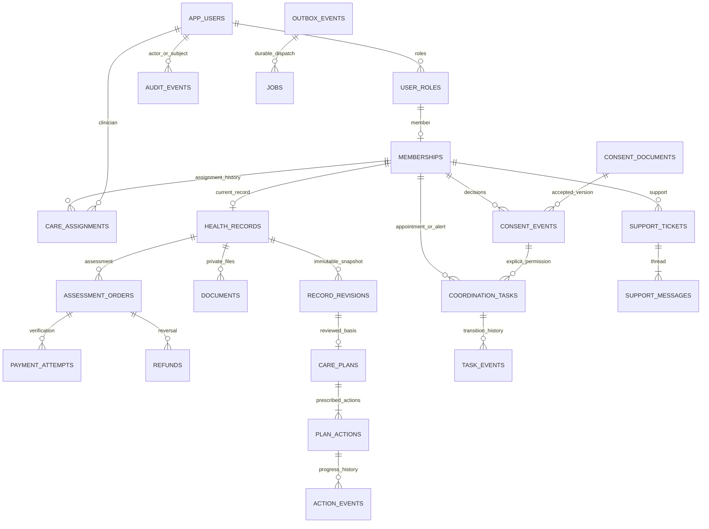

# سلامت‌بان — طراحی دیتابیس مشترک برای ظرفیت ۱۰۰۰ عضو فعال

تاریخ: ۶ اکتبر ۲۰۲۶. وضعیت: **طراحی هدف برای پیاده‌سازی؛ روی برنامهٔ فعلی اعمال نشده است.**

این سند و [DDL مرجع PostgreSQL](postgresql-target-schema.sql) مکمل [معماری سامانه](SALAMATBAN-1000-USERS-fa.md) هستند. معماری هدف یک API ماژولار Node، PostgreSQL مشترک، مخزن خصوصی سازگار با S3 و worker مستقل دارد. دیتابیس نسخهٔ نمایشی GitHub Pages همچنان SQLite داخل مرورگر است؛ کد سرور فعلی همچنان D1/R2 دارد. این فایل، فایل migration فعال آن دو نیست و نشانهٔ آزمون بار موفق یا استقرار سرور جدید نیست.

## ۱. تعریف ظرفیت و محدوده

- ۱۰۰۰ **حساب عضو فعال‌شده برای ورود** سقف اولیهٔ قابل تنظیم پذیرش است. دعوت‌هایی که امکان ورود دارند نیز ظرفیت مصرف می‌کنند. کارکنان ظرفیت عضو مصرف نمی‌کنند.
- ۱۰۰۰ کاربر فعال روزانه/ماهانه یک شاخص استفاده است؛ ۱۰۰۰ کاربر هم‌زمان تعریف دیگری دارد. تغییر مقدار ظرفیت، هیچ‌یک از این دو را تضمین نمی‌کند. آزمون هم‌زمانی و بار طبق سند معماری انجام می‌شود.
- هر عضو یک پروندهٔ جاری با نسخه‌های تاریخی دارد؛ یک خدمت ارزیابی پایه، نسخه‌های متعدد برنامهٔ پزشک و پیگیری اقدام‌ها در هسته است. خرید ارزیابی مستقل تکرارشونده، اشتراک، تقویم ظرفیت مراکز و یادآوری خودکار محصول، توسعهٔ بعدی‌اند و در DDL هسته به‌صورت قابلیت آماده معرفی نشده‌اند.
- سقف فعلی ۱۰ مدرک فعال برای هر پرونده و ۱۰ MiB برای هر فایل حفظ می‌شود. فایل در انتظار انتقال یا اسکن هم یک جایگاه مصرف می‌کند. پسوند فایل، اندازه، امضای واقعی و نتیجهٔ اسکن باید بررسی شوند.

در کد فعلی، سقف ۵۰ هم در `site/lib/pilot/service.ts` مسیرهای `staff/invite` و `staff/member` و هم در trigger `pilot_member_limit` در `site/drizzle-pilot/0001_guards.sql` وجود دارد. **فقط تغییر متن رابط یا یکی از این دو کنترل، مهاجرت ظرفیت نیست.** طرح PostgreSQL این کنترل‌ها را با قرارداد تراکنشی بخش ۶ جایگزین می‌کند؛ سرویس سرور و migrationهای فعال در این تحویل معماری تغییر نکرده‌اند.

## ۲. قرارداد انواع و داده‌های حساس

| موضوع | قرارداد هدف |
|---|---|
| شناسه | UUID در برنامه تولید می‌شود؛ SQL به extension وابسته نیست. شناسهٔ قدیمیِ غیر UUID فقط در جدول نگاشت مهاجرت نگهداری می‌شود. |
| لحظهٔ وقوع | `timestamptz` با UTC؛ نمایش با منطقهٔ `Asia/Tehran`. `created_at`/`updated_at` در تراکنش سرور تعیین می‌شوند؛ `updated_at` trigger خودکار ندارد. |
| روز تولد و موعد | `date` میلادی معتبر؛ API به صورت `YYYY-MM-DD` و رابط شمسی. تبدیل به UTC نیمه‌شب برای یک «روز» لازم نیست. |
| زمان نوبت | `scheduled_at timestamptz`؛ API زمان با offset یا زمان + منطقه می‌گیرد. متن مبهم نسخهٔ قدیمی در `legacy_schedule_text` می‌ماند و خودکار حدس زده نمی‌شود. |
| پول | عدد صحیح `bigint` به **ریال**؛ مقدار از کاتالوگ و نسخهٔ قیمت سرور. سقف فعلی یک میلیارد ریال در طرح حفظ شده و زیر حد integer دقیق JavaScript است. تغییر سقف نیازمند بازبینی serialization است. |
| تلفن | E.164 مانند `+989xxxxxxxxx`، یکتا. ارقام فارسی/عربی و قالب `09…` هنگام ورود عادی‌سازی می‌شوند. شماره به log، صف عمومی یا تحلیلگر ثالث فرستاده نمی‌شود. |
| اطلاعات پرونده | `profile` و `answers` از نوع JSONB با تعریف نسخه‌دار؛ API فقط کلیدهای allowlist و پاسخ‌های پرسش‌نامهٔ مصوب را می‌پذیرد. `birth_date` ستون مرجع است و از `profile` حذف می‌شود؛ adapter قدیمی آن را دوباره به پاسخ `profile.birthDate` می‌افزاید. |
| snapshot | JSONB تغییرناپذیر شامل مشخصات، روز تولد ISO، پاسخ‌ها، نسخهٔ پرسش‌نامه، وضعیت هشدار، رضایت‌های مستند و manifest مدارک شامل شناسه/کلید/نسخه/هش. SHA-256 با canonical JSON مشخص و ثابت محاسبه شود. |
| مدارک | بدنهٔ فایل فقط در object storage خصوصی؛ DB فقط metadata، کلید غیرقابل حدس، checksum و وضعیت. کلید object در API عمومی یا log بازگردانده نمی‌شود. |
| اسرار | کلید OTP، MFA کارکنان، SMS، درگاه و اسکن در secret manager، نه این schema، Git یا JSON پرونده. دیتابیس digest نشست و HMAC کد OTP را دارد؛ کد و token خام در log ممنوع‌اند. |

`JSONB` جای اعتبارسنجی پزشکی یا قراردادی را نمی‌گیرد. اندازهٔ درخواست JSON حداکثر ۵۰KB فعلی نقطهٔ شروع است؛ محدودیت اندازهٔ snapshot و export جدا تعیین می‌شود. JSON پرونده GIN سراسری ندارد: صف‌ها با ستون‌های وضعیت و تخصیص جست‌وجو می‌شوند و ایجاد ایندکس روی تمام محتوای پزشکی بدون کاربرد مشخص لازم نیست.

## ۳. نمودار رابطهٔ منطقی

نمودار، روابط اصلی محصول را نشان می‌دهد؛ جدول‌های عملیاتی کوچک در واژه‌نامه و SQL کامل‌اند.



## ۴. واژه‌نامهٔ ۲۷ جدول هسته

کلیدها، نوع همهٔ ستون‌ها، CHECKها، FKها و ایندکس‌ها در [فایل SQL](postgresql-target-schema.sql) قابل بررسی‌اند. روابط مالکیت تکرارشده در ستون `member_id` با FK مرکب به هم متصل‌اند؛ نباید فقط با join اختیاری در برنامه کنترل شوند.

| جدول | مسئولیت و ستون‌های اصلی | قید مهم |
|---|---|---|
| `app_users` | هویت عمومی: `id`, `phone_e164`, `display_name`, `enabled`, `pseudonymized_at` | تلفن یکتا؛ خالی شدن آن فقط در بی‌نام‌سازی مصوب. |
| `user_roles` | نقش‌های قابل انتخاب و تاریخ اعطا/لغو | PK مرکب کاربر/نقش. FK وجود نقش را تضمین می‌کند؛ فعال بودن نقش در API بررسی می‌شود. |
| `service_capacity` | یک ردیف با `enabled_member_limit=1000` | قفل مشترک همهٔ مسیرهای پذیرش؛ شمارندهٔ قابل drift ندارد. |
| `memberships` | دعوت، فعال بودن عضویت، نسخه و اولین ورود | FK به نقش `member`؛ `disabled_at` با `enabled` سازگار. |
| `care_assignments` | تاریخچهٔ پزشک مسئول، تعیین‌کننده و دلیل جابه‌جایی | فقط یک تخصیص پایان‌نیافته برای هر عضو؛ FK نقش پزشک. |
| `auth_otp_challenges` | challenge، HMAC، انقضا، مصرف و تلاش | حداکثر پنج تلاش؛ مصرف با UPDATE شرطی. |
| `auth_sessions` | digest token، نقش جاری، CSRF، انقضای مطلق، `last_seen_at`، زمان تأیید MFA و لغو | نقش جاری به نقش ثبت‌شدهٔ کاربر متصل؛ انقضای بیکاری و تازگی MFA در API طبق قرارداد معماری بررسی می‌شوند. |
| `rate_limit_buckets` | شمارندهٔ مشترک بین replicaها | کلید HMAC، افزایش اتمیک و پاک‌سازی زمان‌دار. |
| `consent_documents` | متن کامل رضایت مصوب، scope، نسخه و هش | نسخهٔ یکتا در هر scope؛ فقط append. |
| `consent_events` | پذیرش/پس‌گرفتن، زمان، کانال و شواهد؛ مرکز و دامنهٔ افشا در صورت نیاز | رضایت برای همان عضو؛ تاریخچه overwrite نمی‌شود. |
| `health_records` | آخرین draft/پروندهٔ جاری، پاسخ‌ها، رضایت مرجع، هشدار، وضعیت و `version` | یک پرونده برای هر عضو؛ به‌روزرسانی خوش‌بینانه. |
| `record_revisions` | snapshot تغییرناپذیر برای submission و مبنای انتشار | PK پرونده/نسخه، JSON نسخه‌دار و SHA-256؛ اطلاعات جاری جای تاریخچه را نمی‌گیرد. |
| `documents` | metadata مدرک، رزرو، scan، نسخهٔ object و tombstone | ۱۰MiB، نوع مجاز و checksum یکتای فعال در مالک؛ سقف تعداد با تراکنش. |
| `assessment_orders` | مبلغ و قیمت سروری، محصول ارزیابی، وضعیت، نسخه و کلید تکرار | حداکثر یک سفارش باز/پرداخت‌شدهٔ مؤثر برای پرونده؛ تاریخچهٔ شکست حذف نمی‌شود. |
| `payment_attempts` | درخواست/verify، provider، authority، مرجع و مبلغ تأییدشده | مبلغ مورد انتظار FK به سفارش؛ verified فقط با مبلغ دقیق و مرجع، یک verify موفق برای سفارش. |
| `refunds` | درخواست تا نتیجهٔ بازپرداخت با مبلغ، دلیل و مرجع | کلید تکرار یکتا؛ مجموع مبالغ در تراکنش قفل سفارش کنترل می‌شود. |
| `care_plans` | نسخهٔ منتشرشدهٔ پزشک، نام تاریخی او در `reviewer_display_name`، خلاصه و شمارهٔ نسخهٔ مبنا | دو unique برای نسخهٔ برنامه و نسخهٔ پرونده؛ FK snapshot و نقش پزشک. |
| `plan_actions` | حداکثر ۱۲ اقدام نسخهٔ برنامه: عنوان، دلیل، موعد، مسئول | جایگاه ۱ تا ۱۲ یکتا؛ پس از انتشار تغییر نمی‌کند. |
| `action_events` | هر ثبت/برگشت انجام کار، مدرک متنی و actor | FK مرکب به اقدام/برنامه/عضو؛ `sequence` ترتیب تخصیص یکتا و tie-breaker است، نه ترتیب commit کل DB. |
| `coordination_tasks` | نوبت یا هشدار، وضعیت، مسئول، زمان ساختاریافته و رضایت‌ها | یک هشدار باز برای عضو؛ نوبت تأییدشده بدون مرکز/زمان/مرجع/رضایت مرکز ثبت نمی‌شود. |
| `task_events` | تاریخچهٔ وضعیت و دلیل عملیات کارشناس/پزشک | نسخهٔ یکتای هر task؛ همان عضو. |
| `support_tickets` | مسئله/پیشنهاد/دریافت داده/حذف/بازپرداخت و وضعیت رسیدگی | نسخه برای جلوگیری از پاسخ هم‌زمان ناسازگار. |
| `support_messages` | پیام‌های عضو و پاسخ‌های پشتیبانی | append، ترتیب زمان/شناسه؛ محتوای حساس احتمالی فقط برای مسئول رسیدگی. |
| `audit_events` | چه کسی، روی چه منبعی، چه عملی، با چه نتیجه و request ID | append؛ actor انسانی FK دارد؛ سیستم/درگاه actor UUID جعلی نمی‌گیرند. |
| `outbox_events` | رویداد همان تراکنش دامنه با کلید یکتا | در commit کار اصلی گم نمی‌شود؛ dispatch پس از درج job در همان تراکنش علامت می‌خورد. |
| `jobs` | کار پس‌زمینه، dedupe، retry، lease و بن‌بست | `SKIP LOCKED` و fencing token؛ اجرای حداقل یک‌باره، نه ادعای exactly-once. |
| `idempotency_keys` | اثر درخواست تکراری عضو/کارمند در یک scope | کلید+actor+scope یکتا و هش بدنه؛ تکرار با بدنهٔ متفاوت خطا. |

نام پزشک در لحظهٔ انتشار از حساب تأییدشدهٔ سرور در `care_plans.reviewer_display_name` و نقش او در `reviewer_role` ثبت می‌شود؛ تغییر بعدی نام حساب، متن تاریخی را عوض نمی‌کند. snapshot پروندهٔ قبلاً ثبت‌شده برای افزودن نام پزشک تغییر نمی‌کند. جدول `record_revisions` مبنای بالینی را نگه می‌دارد؛ برای گزارش بالینی آینده اگر query روی پاسخ مشخص لازم شد، projection نسخه‌دار جدا ایجاد شود، نه خروج مستقیم JSON کل پرونده برای هر نقش.

## ۵. وضعیت‌ها و مرز تضمین دیتابیس

| منبع | وضعیت مجاز | قرارداد تغییر |
|---|---|---|
| پرونده | `draft → submitted → published`؛ `submitted/published → needs_information → submitted` | عضو فقط draft/نیازمندتکمیل را ویرایش می‌کند. رسیدگی هشدار فقط پزشک مسئول؛ انتشار با هشدار حل‌نشده ممنوع. |
| مدرک | `storage_status`: `reserved/stored/failed/purged`؛ `scan_status`: `pending/clean/rejected/error` | دانلود فقط stored+clean+بدون حذف؛ `deleted_at` حذف منطقی و `purged_at` حذف فیزیکی را جدا ثبت می‌کنند. |
| سفارش | `requesting/pending/reconciliation/paid/failed/cancelled/refund_requested/partially_refunded/refunded` | callback فقط محرک verify سروری است. خطای شبکه، paid نمی‌سازد؛ به reconciliation می‌رود. |
| تلاش پرداخت | `initiated/pending/verified/failed/unknown` | unknown نیازمند استعلام، با retry کور سفارش تازه ساخته نمی‌شود. |
| بازپرداخت | `requested/processing/succeeded/failed/unknown` | نتیجهٔ قطعی provider شرط موفقیت است. unknown ظرفیت مبلغ بازپرداخت را همچنان رزرو می‌کند. |
| نوبت | `requested → contacted → confirmed → completed`؛ لغو از سه حالت اول | مرکز، زمان، مرجع و رضایت **همان مرکز و همان افشا** پیش از تأیید. |
| هشدار | `open → resolved` | پزشک مسئول + دلیل؛ نقش هماهنگ‌کننده آن را نمی‌بیند. |
| job | `ready → running → succeeded`؛ retry به ready؛ اتمام تلاش به dead | پایان کار فقط با lease معتبر همان worker؛ dead نیازمند مشاهده و بازیابی عملیاتی. |

CHECK و FK، صحت ساختاری را تضمین می‌کنند. **موارد زیر عمداً نیازمند سرویس تراکنشی‌اند و صرف اجرای DDL آن‌ها را پیاده نمی‌کند:** اعتبار پزشکی و سن، پذیرش آخرین رضایت و scope/تصمیم آن، پزشک فعال و تخصیص‌یافته، تعداد حداقل یک اقدام برنامه، حدود زمانی موعد، مسیر مجاز تغییر وضعیت، رزرو ظرفیت/فایل، مجموع بازپرداخت، idempotency provider و منع درج اقدام تازه به برنامهٔ قبلاً منتشرشده. API در تست‌های منفی باید این موارد را ثابت کند.

برای نقش runtime فقط `SELECT, INSERT` روی `consent_documents`, `consent_events`, `record_revisions`, `care_plans`, `plan_actions`, `action_events`, `task_events`, `support_messages`, `audit_events` داده شود؛ `UPDATE/DELETE/TRUNCATE` و مالکیت جدول داده نشود. `consent_documents` بهتر است برای runtime وب فقط SELECT و برای ابزار انتشار محتوای مصوب INSERT داشته باشد. برای جدول‌های mutable فقط مجوز لازم داده شود؛ هیچ `GRANT ALL ON ALL TABLES` برای برنامه استفاده نشود. role migration مالک schema است و credential آن به web/worker داده نمی‌شود. sequence درج `action_events` به `USAGE` برای role نویسنده نیاز دارد. worker به jobs/outbox و عملیات مشخص provider دسترسی دارد؛ ابزار نگهداری دسترسی جدا، زمان‌دار و ممیزی‌شده دارد.

نمونهٔ دقیق بخش append-only در migration مجوزها، پس از ایجاد role اختصاصیِ غیرمالک `salamatban_web` بدون عضویت در role مالک؛ نام role در مقصد تثبیت شود. این نمونه خودکار در DDL اجرا نشده است:

```sql
GRANT USAGE ON SCHEMA public TO salamatban_web;
GRANT SELECT ON consent_documents TO salamatban_web;
GRANT SELECT, INSERT ON consent_events, record_revisions, care_plans,
  plan_actions, action_events, task_events, support_messages, audit_events TO salamatban_web;
REVOKE UPDATE, DELETE, TRUNCATE ON consent_documents, consent_events, record_revisions,
  care_plans, plan_actions, action_events, task_events, support_messages, audit_events FROM salamatban_web;
GRANT USAGE ON SEQUENCE action_events_sequence_seq TO salamatban_web;
-- Mutable tables get explicit per-module privileges in a separate role migration.
-- No table ownership, superuser or inherited owner privilege for this role.
```

این محدودیت‌های DB از ویرایش مستقیم تاریخچه با credential معمول برنامه جلوگیری می‌کنند؛ درج‌های دامنه همچنان باید از سرویس مجاز عبور کنند. RLS در این DDL فعال نشده است؛ کنترل مالکیت و نقش در API شرط انتشار است. مدیر محصول با نقش `admin` مجوز خواندن متن بالینی ندارد. در صورت انتخاب RLS، سیاست‌ها و context اتصال باید به‌عنوان migration و تست جدا اضافه شوند؛ نبودن آن را نباید با RLS فعال گزارش کرد.

## ۶. قراردادهای تراکنش و هم‌زمانی

### پذیرش عضو تا سقف ۱۰۰۰ بدون مسابقه

هر مسیر دعوتِ دارای امکان ورود، فعال‌سازی مجدد، غیرفعال‌سازی و تغییر سقف باید اول همین ردیف را قفل کند. ترتیب قفل در همه مسیرها یکسان است: ظرفیت ← عضویت ← پرونده. در isolation پیش‌فرض `READ COMMITTED`، count **پس از** گرفتن قفل و در statement بعدی انجام شود:

```sql
BEGIN;
SELECT enabled_member_limit FROM service_capacity WHERE singleton = true FOR UPDATE;
SELECT count(*) FROM memberships WHERE enabled;
-- Service: if enabling an inactive/new member and count >= limit, ROLLBACK -> 409 CAPACITY_FULL.
-- Service: validate enabled user, active member role and assigned active clinician.
-- INSERT/UPDATE membership, assignment, audit and outbox in this same transaction.
COMMIT;
```

غیرفعال‌سازی عضویت همراه با لغو نشست‌های عضو انجام می‌شود. غیرفعال‌سازی صرف `app_users` ظرفیت را آزاد نمی‌کند؛ عضویت هم باید بسته شود. کاهش سقف زیر count جاری رد می‌شود. این پروتکل trigger نیست و direct write خارج از آن می‌تواند سقف را بشکند؛ ابزار admin/import نیز باید همان پروتکل را رعایت کند. تست دو تراکنش مستقل برای آخرین جایگاه، ایجاد و فعال‌سازی مجدد، شرط پذیرش است.

### ویرایش، انتشار و پیگیری

ذخیرهٔ draft از الگوی `UPDATE health_records SET ..., version=version+1 WHERE id=$id AND version=$expected AND status IN (...) RETURNING version` استفاده می‌کند. صفر ردیف به معنی 409 و بازخوانی است، نه ذخیرهٔ بی‌صدا روی تغییر پزشک. نوشتن audit و رویداد outbox مربوطه داخل همان commit است.

انتشار در یک تراکنش: تخصیص جاری و فعال بودن پزشک دوباره بررسی می‌شود؛ پرونده قفل و نسخه/وضعیت/هشدار/پرداخت/رضایت اعتبارسنجی می‌شوند؛ snapshot همان نسخه ایجاد یا تطبیق داده می‌شود؛ نسخهٔ برنامه زیر قفل پرونده تعیین می‌شود؛ برنامه و ۱ تا ۱۲ اقدام درج می‌شوند؛ پرونده published و نسخه‌اش افزوده می‌شود؛ audit/outbox درج و commit می‌شوند. شکست هر مرحله همهٔ این نوشتن‌ها را rollback می‌کند. uniqueها انتشار هم‌زمان برای یک نسخه را رد می‌کنند. `MAX(version)+1` بدون قفل کافی نیست.

بازگشایی با دلیل، برنامهٔ قبلی را تغییر نمی‌دهد؛ فقط پرونده را برای اصلاح باز می‌کند. تراکنش ثبت event انجام اقدام ابتدا **همان ردیف پرونده** را طبق ترتیب قفل انتشار قفل می‌کند؛ سپس آخرین برنامهٔ همان عضو را دوباره می‌خواند و فقط برای آن event می‌پذیرد. انتشار نسخهٔ تازه نیز این قفل را می‌گیرد؛ بنابراین ثبت اقدام قدیمی از فاصلهٔ بررسی تا commit با انتشار جدید مسابقه نمی‌دهد. `sequence` ترتیب تخصیص است، نه ترتیب commit جهانی؛ قفل یکسان، ثبت‌های هر پرونده را سری می‌کند و بیشترین sequence وضعیت نهایی اقدام آن پرونده را تعیین می‌کند. تراکنش event و audit با هم commit می‌شوند و محتوای برنامهٔ منتشرشده را تغییر نمی‌دهند.

### مدارک و مرز object storage

۱) قفل پرونده، بررسی رضایت/نسخه/وضعیت، شمارش `deleted_at IS NULL AND storage_status IN ('reserved','stored')` و درج reservation با checksum؛ commit. ۲) انتقال محدودشده به object خصوصی با کلید یکتا. ۳) تراکنش ثبت `stored` و job اسکن. ۴) scanner با همین checksum/نسخه نتیجه را ثبت می‌کند؛ قبل از clean هیچ دانلودی مجاز نیست. خطای انتقال، وضعیت failed می‌گیرد و جایگاه آزاد می‌شود؛ reservation رهاشده با TTL و job reconciliation بسته می‌شود. وجود object بدون DB، حذف منطقی، و از دست رفتن object سه حالت جدا برای reconciliation هستند.

پاک‌سازی orphan فقط بعد از مهلت امن و تطبیق مجدد با DB انجام شود. objectهای referenced در snapshot تا پایان دورهٔ نگهداری مجاز باقی می‌مانند؛ حذف از کتابخانهٔ عضو خودبه‌خود اجازهٔ نابودی مدرک مبنای نسخهٔ منتشرشده نیست. حذف فیزیکی با tombstone و job تکرارپذیر انجام می‌شود؛ تراکنش توزیع‌شده بین PG و S3 وجود ندارد.

### پرداخت و بازپرداخت

ساخت سفارش و payment attempt در یک تراکنش با idempotency انجام می‌شود. سپس تماس بیرونی بدون نگه داشتن قفل DB؛ timeout به معنی شکست قطعی نیست. callback و worker استعلام هر دو با authority و مبلغ سفارش verify سروری می‌کنند؛ پس از پاسخ معتبر، تراکنش قفل سفارش، ثبت verified، paid، audit و outbox را یکجا commit می‌کند. پاسخ خام provider در audit ذخیره نمی‌شود؛ مرجع و کد نتیجهٔ لازم کافی است. پرداخت قبلاً verified دوباره خدمت یا رویداد تکراری نمی‌سازد.

بازپرداخت زیر قفل سفارش، مجموع `requested + processing + unknown + succeeded` را محاسبه می‌کند؛ درخواست تازه نباید ماندهٔ پرداخت‌شده را رد کند. retry همان `idempotency_key` است. اگر provider کلید تکرار نمی‌پذیرد، پس از timeout ابتدا استعلام/رسیدگی انسانی انجام می‌شود؛ DB به‌تنهایی دوباره‌برداشت یا دوباره‌واریز بیرونی را متوقف نمی‌کند. وضعیت سفارش و refund پس از نتیجهٔ قطعی با هم تغییر می‌کنند. اگر ارزیابی پس از refund دوباره فروخته شود، سیاست entitlement و دسترسی به برنامهٔ قبلی باید مشخص شود؛ طرح فعلی سفارش refunded را از قید «یک سفارش مؤثر» خارج می‌کند.

### Outbox، صف و idempotency

outbox فقط شناسه، نوع رویداد و دادهٔ حداقلی لازم می‌گیرد؛ متن بالینی و OTP در payload نگهداری نشوند. dispatcher در یک تراکنش رویدادهای undispatched را با `FOR UPDATE SKIP LOCKED` می‌گیرد، job با `dedupe_key` مشتق از شناسهٔ رویداد/نوع handler درج می‌کند، سپس `dispatched_at` را ثبت می‌کند. crash قبل از commit هیچ‌کدام را اعمال نمی‌کند؛ بعد از commit job موجود است.

OTP در این هسته صفی نیست: challenge و HMAC در DB commit می‌شود، سپس کد فقط از حافظهٔ همان request با timeout محدود ۱۰ تا ۱۵ ثانیه مستقیم برای SMS provider فرستاده می‌شود. کد خام در job/outbox ذخیره نمی‌شود و از HMAC قابل بازیابی نیست. خطا یا timeout challenge را منقضی می‌کند و rate limit را نگه می‌دارد؛ پاسخ عمومی موفقیت تحویل پیامک را وعده نمی‌دهد. retry کاربر challenge تازه می‌سازد و قبلی‌ها را باطل می‌کند. پیام اطلاع‌رسانی غیر OTP می‌تواند با شناسهٔ رویداد و template در صف باشد.

نمونهٔ claim برای worker؛ `$1` نام worker و `$2` UUID تازهٔ lease است:

```sql
WITH candidate AS (
  SELECT id FROM jobs
  WHERE status = 'ready' AND available_at <= now() AND attempts < max_attempts
  ORDER BY available_at, created_at, id
  FOR UPDATE SKIP LOCKED LIMIT 1
)
UPDATE jobs j SET status='running', attempts=attempts+1,
  locked_by=$1, lease_token=$2, lease_expires_at=now()+interval '60 seconds', updated_at=now()
FROM candidate c WHERE j.id=c.id RETURNING j.*;
```

تمدید و موفقیت فقط با `WHERE id=$id AND status='running' AND lease_token=$token AND lease_expires_at>now()`؛ تمام فیلدهای lease هنگام خروج از running پاک می‌شوند. lease برای عملیات طولانی heartbeat دارد. reaper lease منقضی را با backoff به ready یا پس از max_attempts به dead می‌برد. worker قدیمی پس از از دست دادن lease نمی‌تواند نتیجهٔ DB را نهایی کند؛ اثر بیرونی همچنان به idempotency provider نیاز دارد. outbox/jobهای پرداخت برای reconciliation و اسکن در هسته‌اند؛ ارسال یادآوری دوره‌ای خدمت جدید و خارج از پیاده‌سازی این تحویل است.

در API، کلید idempotency قبل از اثر اصلی درج/قفل می‌شود؛ هش request متفاوت برای همان کلید 409 است. عملیات کوتاه DB و response قابل بازپخش داخل یک تراکنش commit می‌شوند. برای عملیات طولانی بیرونی پاسخ 202 و شناسهٔ منبع قابل پیگیری ذخیره شود تا رکورد started برای همیشه آویزان نماند. response_body شامل token نشست یا فایل/پروندهٔ کامل نباشد. کلیدهای مالی در خود سفارش/refund ماندگار می‌مانند؛ پاک‌سازی cache عمومی idempotency اجازهٔ تکرار مالی نمی‌دهد.

## ۷. مسیرهای خواندن و ایندکس‌ها

| مسیر | query و مرز دسترسی | ایندکس مبنا |
|---|---|---|
| ورود | تلفن عادی‌شده؛ role و enabled در هر request حساس | `app_users.phone_e164`, PK نشست و `auth_session_user` |
| پروندهٔ عضو | یک record با member ID از session؛ تاریخچه و مدارک جدا و صفحه‌بندی‌شده | unique member روی record؛ `documents_record`, plan record/version |
| صف پزشک | join تخصیص پایان‌نیافتهٔ همان پزشک + عضو فعال + وضعیت/هشدار | `care_assignment_queue`, `records_review_queue` |
| کارتابل هماهنگی | فقط booking و فیلدهای لازم تماس؛ urgent/answers/files/summary برنگردد | `booking_queue`, `task_assignee` |
| پرداخت‌های من | member ID از نشست + cursor زمان/شناسه | `orders_member` |
| تطبیق مالی | requesting/reconciliation با زمان آخرین تغییر | `orders_reconciliation`, `payment_order` |
| اقدام‌ها | برنامهٔ آخر و event آخر هر action | plan unique version، `actions_latest_state` |
| پشتیبانی | عضو مالک یا مسئول مجاز؛ حذف/دریافت داده نیازمند احراز دوباره | `support_member`, `support_queue`, `support_thread` |
| ممیزی | subject/actor/time محدود و با دسترسی مستقل | `audit_subject`, `audit_actor`, BRIN زمان |
| worker | job آماده/lease منقضی؛ خارج از request تعاملی | `jobs_ready`, `jobs_expired_lease`, `outbox_pending` |

صف‌ها page-size پیش‌فرض ۲۵ و حداکثر ۱۰۰ دارند؛ cursor با tie-breaker شناسه لازم است. endpoint فعلی `/record` کل orders/plans/updates را یکجا می‌خواند و `/staff/queue` فهرست کامل دارد؛ در مقصد باید جدا/صفحه‌بندی شوند و projection سازگار برای رابط فعلی داشته باشند. روی fixture نماینده `EXPLAIN (ANALYZE, BUFFERS)` گرفته شود؛ وجود ایندکس به‌تنهایی زمان پاسخ را ثابت نمی‌کند. هیچ read replica برای ۱۰۰۰ عضو الزام ذاتی نیست؛ standby هدف بازیابی است و read-after-write پرونده/پرداخت باید از primary باشد.

## ۸. نگاشت دقیق از ۱۴ جدول فعال (۱۲ جدول پایه به‌اضافهٔ آدرس و اتصال اقدام به کار)

منبع بررسی: [schema فعال](../../source/site/db/pilot-schema.ts)، [migration پایه](../../source/site/drizzle-pilot/0000_optimal_wind_dancer.sql)، [قیدهای مسابقه](../../source/site/drizzle-pilot/0001_guards.sql)، [سرویس فعال](../../source/site/lib/pilot/service.ts) و [قرارداد دامنه](../../source/site/lib/pilot/domain.ts). `reference-code` مرجع تاریخی است و migration آن روی مقصد اعمال نمی‌شود.

| مبدأ | مقصد و تبدیل | نکتهٔ اعتبارسنجی |
|---|---|---|
| `pilot_users` | users + roles + memberships + care_assignments | تلفن به E.164؛ `active` عضو به هر دو enabled؛ `clinician_id` به تاریخچهٔ تخصیص. زمان شروع ناشناخته با برچسب import و زمان مشاهده ثبت شود، تاریخ جعلی دقیق نسازید. |
| `pilot_otp` | منتقل نمی‌شود؛ challenge تازه | کدهای در گردش منقضی و احراز دوباره. |
| `pilot_sessions` | منتقل نمی‌شود؛ نشست‌ها باطل | کلیدها و نشست demo هیچ‌وقت production نمی‌شوند. |
| `pilot_records` | health_records + snapshotهای موجود + consentها | JSON parse و نسخهٔ پرسش‌نامه مشخص؛ birthDate به date؛ epoch میلی‌ثانیه به `to_timestamp(ms/1000.0)`؛ نسخه/status/urgent/information_request حفظ شود. |
| `pilot_files` | documents + کپی object با SHA تطبیق | `demo_only` دادهٔ قابل اعتماد پزشکی نیست و import live نمی‌شود؛ clean قدیمی طبق سیاست مقصد دوباره اسکن شود. |
| `pilot_orders` | assessment_orders + یک یا چند payment_attempt | فقط دادهٔ واقعی با mode live و verify مستقل؛ authority/reference یکتا؛ demo پرداخت واقعی نمی‌سازد. |
| `pilot_plans` | record_revisions + care_plans + plan_actions | `record_snapshot` عیناً حفظ و version مبنا نگهداری؛ actions JSON به ردیف‌ها. snapshot قدیمی همهٔ شواهد جدید را ندارد؛ فیلد مفقود را ناشناخته علامت بزنید، نه آنکه با دادهٔ امروز پر کنید. |
| `pilot_action_updates` | action_events | FK action در JSON برنامه تطبیق؛ ترتیب `created_at` و tie-breaker ID قدیمی ثبت شود. اگر هم‌زمانی مبهم است آن را گزارش کنید؛ زمان جعلی نسازید. |
| `pilot_tasks` | coordination_tasks + event اولیهٔ import | نوبت مبهم تا تبدیل دستی در `legacy_schedule_text`؛ رضایت مرکز و timestamp معتبر نداریم؟ در staging به استثنای مهاجرت می‌رود و confirmed جعلی ساخته نمی‌شود. |
| `pilot_feedback` | support_tickets + پیام عضو و در صورت وجود پاسخ | تاریخ پاسخ مستقل در مبدأ موجود نیست؛ زمان import/نشان legacy استفاده و محدودیت گزارش شود. |
| `pilot_audit` | audit_events | actorهای `gateway`/سیستم به actor_type؛ رشتهٔ خالی به NULL؛ request ID جدید فقط شناسهٔ import است، نه request اصلی. |
| `pilot_rate_limits` | انتقال لازم نیست؛ bucketهای تازه | هنگام cutover محدودیت لبه و کنترل ارسال OTP فعال بماند تا reset باعث موج درخواست نشود. |
| `pilot_booking_locations` | در DDL هدف ۱٫۰ هنوز مدل متناظر ندارد | قبل از مهاجرت باید مدل آدرس/مختصات با سیاست نگهداری و حذف افزوده و آزموده شود؛ حذف بی‌صدای این داده مجاز نیست. |
| `pilot_task_actions` | رابطهٔ coordination_tasks با plan_actions در DDL هدف ۱٫۰ هنوز تعریف نشده | افزودن FK مالکیت و اتصال به نسخهٔ برنامه و آزمون تکرار/انتشار لازم است؛ این وابستگی را از عنوان کار حدس نزنید. |

مبدأ فقط نسخه/هش رضایت ترکیبی و checkbox هماهنگی را نگه می‌دارد و همهٔ سند/زمان/شاهد مورد نیاز مقصد را ندارد. **رضایت مصوب را از روی checkbox اختراع نکنید.** متن دقیق همان نسخه، هش و شواهد تأیید اگر موجود بود با گزارش provenance وارد می‌شود؛ در غیر این صورت پذیرش جدید لازم است و transition ارسال پرونده/هماهنگی تا تکمیل آن متوقف می‌ماند. `approved_at` در مقصد تاریخ تأیید واقعی سند است؛ تاریخ قدیمی کاربر یا import جای آن نیست. همهٔ نمونه‌های demo از پایگاه production حذف می‌شوند؛ برنامهٔ نمایشی مستقل حفظ می‌شود.

طرح هدف ۱٫۰ پیش از افزوده‌های اجرایی ۱٫۵ و ۱٫۶ نوشته شده است؛ ۷۵ بررسی ثبت‌شده مربوط به همان DDL با ۲۷ جدول‌اند. پوشش دو نگاشت بالا نیازمند توسعه و آزمون تازه است و این بسته آن را انجام‌شده اعلام نمی‌کند.

SQL فعلی `INSERT INTO ... VALUES` وابسته به ترتیب ستون و نحو SQLite/D1 است؛ این SQLها مستقیماً روی PostgreSQL اجرا نمی‌شوند. repositoryهای ماژولار، placeholderهای PG، transaction API و مدل خطای unique/version باید بازنویسی و تست شوند. API `/api/pilot` تا پایان انتقال رابط با adapter قرارداد به `/api/v1` نگاشت می‌شود؛ این schema جای adapter را پیاده نکرده است.

## ۹. روند مهاجرت و مرز rollback

1. مقصد staging مستقل و secrets مستقل ایجاد؛ DDL نسخه‌گذاری‌شده روی DB خالی اجرا؛ roleهای migration/web/worker/backup تعریف؛ schema test، منفی‌های دسترسی و آزمون‌های هم‌زمانی اجرا شوند.
2. inventory مبدأ، شمارش هر جدول، snapshot سازگار و manifest فایل‌ها تهیه؛ mapping شناسه‌ها در مخزن مهاجرت خصوصی ثبت؛ dry-run import روی کپی و گزارش خطاهای رضایت/فایل/زمان/پرداخت تولید شود. اطلاعات demo به fixture تست محدود بماند.
3. دادهٔ واقعی با رضایت و پرداخت قابل اثبات وارد شود؛ checksum فایل‌ها، row count، FK، نسخهٔ برنامه/پرونده، مالک هر فایل/اقدام، صف هشدار و مجموع مالی تطبیق داده شود. exceptionها نباید با defaultهای ساختگی خاموش شوند.
4. در cutover، نوشتن مبدأ متوقف و drain شود؛ snapshot نهایی/تغییرات با همان mapping منتقل شود. دو سامانه هم‌زمان نویسنده نباشند. callbackهای پرداخت هنگام انتقال در ورودی پایدار ثبت یا قابل استعلام بمانند؛ پیش از باز شدن مقصد reconciliation سفارش‌های باز انجام شود.
5. smoke مشترک عضو/پزشک/هماهنگ‌کننده، verify پرداخت آزمایشی، دانلود مدرک مجاز، رد دسترسی غیرمجاز و restore آزمایشی موفق؛ سپس به‌تدریج ترافیک نوشتن باز شود. مهاجرت ظرفیت از ۵۰ به ۱۰۰۰ تنها پس از gateهای عملیاتی و آزمون بار است.

**پیش از اولین نوشتن واقعی مقصد:** می‌توان route را به مبدأ برگرداند، چون مبدأ هنوز مرجع آخرین داده است. **پس از اولین نوشتن یا پرداخت مقصد:** برگشت DNS به دیتابیس قدیمی rollback ایمن نیست؛ مقصد مرجع است. نسخهٔ سازگار API را روی همین DB برگردانید یا writeها را متوقف و forward-fix کنید. برگشت داده فقط با reverse migration آزمایش‌شده و reconciliation مالی/فایل انجام شود. backup پیش از cutover برای حادثه است، نه اجازهٔ حذف تراکنش‌های جدید.

## ۱۰. پشتیبان‌گیری، حذف و برآورد حجم

هدف پیشنهادی معماری **RPO حداکثر ۱۵ دقیقه و RTO حداکثر ۴ ساعت** است؛ تا restore واقعی اندازه‌گیری نشود تضمین‌شده نیست. PostgreSQL به backup پایه و WAL archive/PITR، رمزنگاری و نسخهٔ خارج از میزبان اصلی نیاز دارد؛ standby جای backup نیست. object storage به versioning، checksum inventory و نسخهٔ پشتیبان مستقل نیاز دارد. بازیابی DB و objects باید به manifest زمانی مشترک برسد تا DB به فایل ازدست‌رفته اشاره نکند. secrets/کلید رمزگشایی جدا و قابل بازیابی نگهداری شوند.

پیشنهاد عملیاتی اولیه، روزانه backup پایه، WAL پیوسته و ۳۰ روز پنجرهٔ بازیابی است؛ هزینه و امکان ارائه‌دهنده باید تأیید شود. این عدد **مدت قانونی نگهداری پرونده یا اسناد مالی نیست**. پیش از پذیرش اطلاعات واقعی، مسئول محصول/بالینی و مشاور حقوقی باید برای پرونده، مدرک، رضایت، مالی، audit و backup سیاست مصوب مدت/دسترسی/استثنا/حذف تعیین کنند.

| دسته | روش پیشنهادی؛ مدت نهایی نیازمند تصویب |
|---|---|
| OTP و نشست منقضی | job پاک‌سازی کوتاه‌مدت؛ اصل هدف TTL عملیاتی است، نه نگهداری کد برای گزارش. رویداد ورود metadata در audit باقی می‌ماند. |
| فایل و پرونده | درخواست حذف احراز و بررسی hold/نیاز قانونی شود؛ حذف منطقی، job فیزیکی شامل همهٔ نسخه‌های object و تأیید پایان. snapshotهای مبنا هم مشمول سیاست حذف‌اند و نباید فراموش شوند. |
| مالی | حذف حساب الزاماً اجازهٔ حذف سفارش/مرجع مالی نیست؛ دادهٔ لازم مالی حداقلی با شناسهٔ بی‌نام نگهداری و PII اضافی پاک شود. مدت حدس زده نمی‌شود. |
| audit و رضایت | append در مسیر عادی؛ محدودیت دسترسی و حذف دوره‌ای فقط با role نگهداری و سیاست مصوب. متن پزشکی، شماره و OTP در audit نیست. |
| پشتیبان | دادهٔ حذف‌شده با پایان پنجرهٔ مصوب backup خارج می‌شود؛ restore باید فهرست tombstone/حذف را دوباره اعمال کند تا دادهٔ حذف‌شده احیا نشود. |
| outbox/job/idempotency | payload حداقلی؛ پس از پایان مهلت retry/رسیدگی پاک‌سازی یا خلاصه شود. dedupe مالی ماندگار در سفارش/refund حفظ شود. |

روابط SQL عمداً `ON DELETE CASCADE` برای حذف عضو ندارند. پاک‌کردن یک user نباید ناخواسته پول، رضایت یا پروندهٔ پزشک را حذف کند. بی‌نام‌سازی و سپس حذف کنترل‌شده طبق dependency plan انجام می‌شود؛ `phone_e164=NULL` فقط با `pseudonymized_at` مجاز است. در export، فقط دادهٔ همان عضو، لینک کوتاه‌عمر خصوصی و ممیزی دانلود؛ export عمومی یا ایمیل حاوی فایل خام ممنوع.

برآورد برای برنامه‌ریزی، نه اندازه‌گیری: `۱۰۰۰ × ۱۰ × ۱۰MiB` حداکثر حدود **۹۷٫۷ GiB فایل فعال** است. با فرض مجموع active + version history + backup برابر سه برابر، حدود **۲۹۳ GiB** object لازم می‌شود؛ تاریخچه یا replication طولانی‌تر این مقدار را زیاد می‌کند. فایل‌ها داخل DB نیستند. برای نمونه، ۱۲ هزار snapshot سالانه با میانگین ۱۰۰KiB حدود ۱٫۱۵GiB خام است. مطابق سناریوی محافظه‌کارانهٔ سند معماری، ۱۰۰ هزار رویداد audit روزانه با ۱KiB برای هر رویداد حدود **۳۴٫۸GiB خام سالانه** و با سربار تقریبی دوبرابر جدول/ایندکس حدود **۷۰GiB** است؛ WAL و backup جدا حساب می‌شوند. تخصیص اولیهٔ ۱۰۰GiB دیتابیس باید با هشدار ۷۰٪ و روند رشد گسترش یابد. ترافیک واقعی و نگهداری می‌تواند این‌ها را تغییر دهد؛ اندازه‌گیری پس از آغاز پایلوت لازم است.

## ۱۱. معیار تحویل توسعهٔ مقصد

- DDL روی PostgreSQL 17 خالی بدون extension اجرا شود؛ FK/unique/checkهای مالکیت، مبلغ و نسخه با fixture مثبت/منفی تست شوند. نتیجهٔ چنین تستی فقط طراحی فیزیکی را تأیید می‌کند، نه آماده بودن API مقصد.
- دو پذیرش هم‌زمان در آخرین ظرفیت فقط یکی موفق؛ دو upload برای جایگاه دهم فقط یکی رزرو؛ دو انتشار یک نسخه فقط یک برنامه؛ callback تکراری فقط یک verify/اثر مالی؛ مجموع refund بیشتر از پرداخت رد شود.
- role runtime نتواند snapshot/برنامه/audit را UPDATE یا DELETE کند؛ عضو نتواند پروندهٔ دیگری و هماهنگ‌کننده نتواند متن بالینی را بخواند؛ پزشک بدون تخصیص رد شود.
- crash پس از commit دامنه ولی قبل از dispatch، پس از claim job، حین timeout درگاه و هنگام کپی object شبیه‌سازی و بدون گم شدن کار/اثر مالی تکراری بازیابی شود.
- مهاجرت dry-run با شمارش/هش/جمع مالی و فهرست exception، backup/restore زمان‌گیری‌شده و آزمون بار مطابق سند معماری تحویل شود. تا این موارد اجرا نشده‌اند، عبارت «آمادهٔ ۱۰۰۰ کاربر واقعی» استفاده نشود.

مواردی که تصمیم انسانی می‌خواهند: محل مجاز نگهداری داده و ارائه‌دهنده، سیاست نگهداری/حذف، متن مصوب رضایت، قیمت و قواعد بازپرداخت، ساعات و ظرفیت کادر درمان و escalation هشدار، و تعریف تجاری ارزیابی مجدد یا اشتراک. وجود ستون یا job، این تصمیم‌ها را به‌جای مجموعه نمی‌گیرد.

## ۱۲. نتیجهٔ اعتبارسنجی این طرح و روش تکرار

در این تحویل، DDL نهایی روی **PostgreSQL 17.11 واقعی در کانتینر جدا** اجرا شد: ۲۷ جدول، ۸۶ ایندکس و **۷۵ بررسی موفق**. دادهٔ ساختگی ۱۰۰۰ عضو درج شد؛ FK مالکیت، مبلغ پرداخت، یکتایی نسخه، تاریخ معتبر، نام تاریخی پزشک، مجوزهای append-only و دو claim هم‌زمان job بررسی شدند. برنامهٔ query نمونهٔ صف از `records_review_queue` استفاده کرد.

[گزارش کامل و هش SQL](../architecture-database-validation.json) و [اعتبارسنج قابل اجرا](../../source/scripts/validate_target_schema.py) همراه سند هستند. این بررسی، تست بار HTTP، آزمون ۱۰۰۰ کاربر هم‌زمان، اتصال API هدف، اجرای واقعی پرداخت یا تمرین بازیابی نیست. پروتکل پذیرش هم‌زمان ظرفیت و مجموع بازپرداخت در سرویس هدف هنوز باید پیاده‌سازی و آزموده شوند؛ فهرست دقیق بررسی‌نشده‌ها در گزارش آمده است.

برای تکرار از ریشه مخزن، Docker و Python 3 لازم‌اند. کانتینر زیر فقط برای آزمون است، شبکه ندارد و پورتی روی میزبان منتشر نمی‌کند؛ تنظیم احراز هویت آن برای سرور واقعی نیست:

```sh
docker run --rm --network none --name salamatban-architecture-pg17 --memory 512m --pids-limit 128 -e POSTGRES_HOST_AUTH_METHOD=trust -d postgres@sha256:b0f9560a2de083e2cc7382e75f808c7381a32852a7ec49117deedb300e552b24
docker exec salamatban-architecture-pg17 pg_isready -U postgres
```

پس از مشاهدهٔ `accepting connections`، اعتبارسنج را اجرا کنید و در پایان همین کانتینر آزمون را متوقف کنید:

```sh
python3 scripts/validate_target_schema.py --container salamatban-architecture-pg17
docker stop salamatban-architecture-pg17
```

اعتبارسنج برای هر اجرا یک دیتابیس و نقش موقت با نام یکتا می‌سازد و در پایان حذف می‌کند؛ گزارش اجرای تازه را در `review-evidence/architecture-database-validation.json` می‌نویسد. فایل SQL مرجع به‌صورت خودکار به برنامهٔ فعلی یا دیتابیس واقعی اعمال نمی‌شود.
